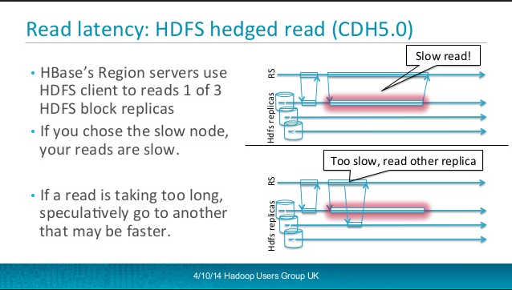

## HBase
HDFS에 구현한 distributed column-oriented NoSQL 데이터베이스이다.
HBase는 대규모 데이터셋에 실시간으로 랜덤 엑세스가 필요할 때 사용할 수 있는 Hadoop library이다.
HBase는 Hadoop의 번들로 제공되며, 어도비, 트위터, 야후 등에서 실사용된다.
 1. 실시간 랜덤 조회 및 업데이트가 가능하다. 
 1. 데이터를 비동기적으로 업데이트(MapReduce는 일괄처리 방식)
 1. Key-Value store로써, Key = [row key, column family, column qualifier, timestamp], value =  [cell contents]
 

## HBase의 특성
 - cluster에 분산된 HBase 테이블들은 region에 의해서 sharding 된다. 그리고 data가 증가할수록 region에 의해 자동으로 수평분할된다. 
 - sparse
 - distributed
 - persistent multidimensional sorted(사전순으로) map
 - HBase의 각 Cell은 row key, column key, timestamp로 indexing 된다.

## HBase Table의 구성
 - Table: Table의 이름은 String이고, file system에 안전한 character들을 사용해서 만들어 진다.
 - Row: Data는 row단위로 저장되고, 각 Row는 unique한 rowkey에 의해 분류된다. 
        RDBMS의 Table PK와 동일
        row key는 data type이 없고 byte[] <-- byte array로 
 - Column Family: 
    - CF는 HBase에 저장된 데이터의 물리적인 정렬에도 영향을 미친다.
    - 모든 Row는 동일한 CF를 갖지만 Row 별로 모두 동일한 데이터를 저장할 필요는 없다.
    - CF의 이름도 마찬가지고 String이고, file path에 맞는 Character를 포함한다. 
 - Column Qualifier: 
    - CF내의 Column을 찾아가기 위한 것
    - CQ도 row key와 마찬가지로 data type이 없고 byte[] <-- byte array
 - Cell
    - rowkey + column family + column qualifier + timestamp
    - Cell의 값도 데이터타입이 없고 byte[] 로 구성된다.
 - Timestamp
    - Cell 값은 버전이 관리되는데, 이를 표현하는게 Timestamp 이다.
    - Cell에 값을 쓸때
        - 값 지정 가능
        - default = current timestamp
    - Cell의 Versioning 갯수는 각 CF별로 설정가능하다(default: 3개)
    - 질의사항
        - timestamp는 눈에 보이는가 ?
        - where절에서 filter할때만 쓰이는가 ? 용도는 ?
  - HBase Component
  
  - HBase Map
  

## HBase vs HDFS
 - HDFS는 분산 파일 시스템으로 각 파일에 대한 빠른 레코드 검색을 지원하지 않는다. 
 - HBase는 HDFS의 상위에서 덩치가 큰 테이블에 대해서 빠른 레코드 검색, 수정을 지원한다. 

## HBase Data Modeling
- [Introduction to HBase Schema Design, Cloudera, Amandeep Khurana](http://0b4af6cdc2f0c5998459-c0245c5c937c5dedcca3f1764ecc9b2f.r43.cf2.rackcdn.com/9353-login1210_khurana.pdf)

## Reading Data from HBase

### Hedged Reads
Block을 읽을때 특정 replica가 속도가 느린경우, 다른 replica의 동일한 Block을 읽는것을 의미한다.
- Hedged Read Configuration
~~~
<property>
  <name>dfs.client.hedged.read.threadpool.size</name>
  <value>20</value>  <!-- 20 threads -->
</property>
<property>
  <name>dfs.client.hedged.read.threshold.millis</name>
  <value>10</value>  <!-- 10 milliseconds -->
</property>
~~~

### Structured
~~~
Scan()
Scan(byte[] startRow)
Scan(byte[] startRow, byte[] stopRow)
~~~

### Unstructured

## Data Load from HDFS to HBase

## HBase API

## HBase Query
- Default로 최신의 Timestamp의 Cell 값을 리턴

### Put
 - 대상: particular row
 - 검색조건: rowkey 필요

### Get
 - 대상: particular row
 - 검색조건: rowkey 필요

### Scan
 - 대상: Range of rows
 - 검색조건: 
    - start rowkey - stop rowkey
    - rowkey 없는 경우 전체 테이블

## Things to study
 - HBase API: Get, Put, Scan

## 참고자료
 - [Apache: HBase Architecture](http://hbase.apache.org/0.94/book/architecture.html)
 - [Apache: HBase Reference Guide](http://hbase.apache.org/book.html)
 - [Cloudera: Importing Data Into HBase](https://www.cloudera.com/documentation/enterprise/5-9-x/topics/admin_hbase_import.html)