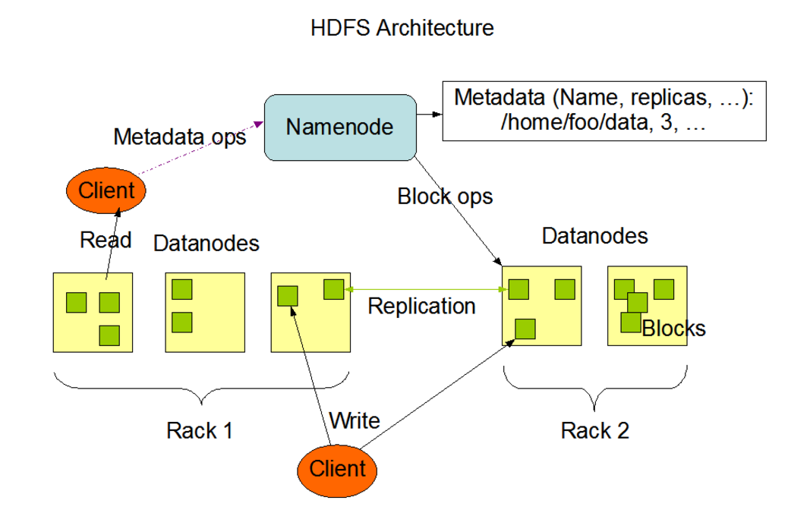

## 분산파일시스템 이란
네트워크를 이용해 접근하는 파일 시스템을 말한다.

## HDFS(Hadoop Distributed File System)
HDFS는 대용량의 파일을 Chunk라는 단위로 분할해 데이터노드에 3개씩 분산 저장한다. 즉 하나의 파일이 분산된 여러 데이터 노드에 저장된다. 보통 Chunk의 단위는 64MB 이다. 
Chunk가 저장된 데이터노드에 대한 메타데이터 정보는 Namenode에 저장한다. 그리고 MapReduce 프레임워크를 이용해 분산 저장된 파일을 읽어 연산하도록 한다. 

## HDFS Architecture

## HDFS 특징
 - 크기가 큰 파일이 청크 단위로 나뉘어 여러 데이터노드에 분산 복제 저장됨
 - 청크 크기는 보통 64MB이고, 각각의 청크는 3개의 복제본이 존재하며, 서로 다른 데이터 노드에 청크가 저장됨
 - 이 청크들에 대한 정보는 네임노드에 저장돼 있음
 - 대용량의 파일을 저장하는 데 유리하며, 파일의 개수가 많으면 네임노드의 부담이 커짐
 - 네임노드가 SPOF(Single Point Of Failure). 네임노드에 장애가 발생하면 운영 불가 상황이 발생하며 수동 복구 필요

## HDFS supported file format
1. Text/CSV Files
    - CSV file은 모든 라인이 record이므로 메타데이터 정보를 포함하여 HDFS에 저장할 수 없다.
    - CSV file은 schema 변경이 불가하므로 새로우 field를 추가하는 경우 맨뒤에 붙이는 형태일 수 밖에 없다. 
    - Block Compression을 사용할 수 없어 퍼포먼스 비용이 높다. 
1. JSON Files
    - text format이고, metadata 및 data정보를 동시에 저장할 수 있다. 
    - schema evolution이 가능하여 field의 변경이 자유롭다. 
    - text file이기 때문에 block compression을 지원하지 않는다. 
1. Avro Files
1. Sequence Files
1. ORC Files
1. Parquet Files
 - columnar format
 - 압출된 형태로, 쿼리 성능을 향상시키며 특정 column에 대한 질의시 효율성이 증대된다. 
 - new column을 데이터 구조의 마지막에 붙일 수 있으며, 원래대로 변경할수도 있다. 
 - HDFS의 특성상 데이터의 I/O는 거의 read performance에서 결정된다.
   (HDFS - write once, read multiple)

## To Study
 - HDFS에서 Chunk로 분할하는 기준은 무엇인가 ?
 - 데이터 노드에 분산 저장시 분산저장하는 기준은 무엇인가 ?
 - 데이터노드와 클러스터의 관계는 ?
 - Namenode는 Datanode 에 1대1로 맵핑된건지 ?

