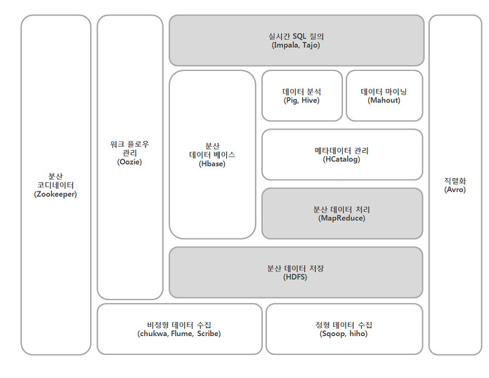
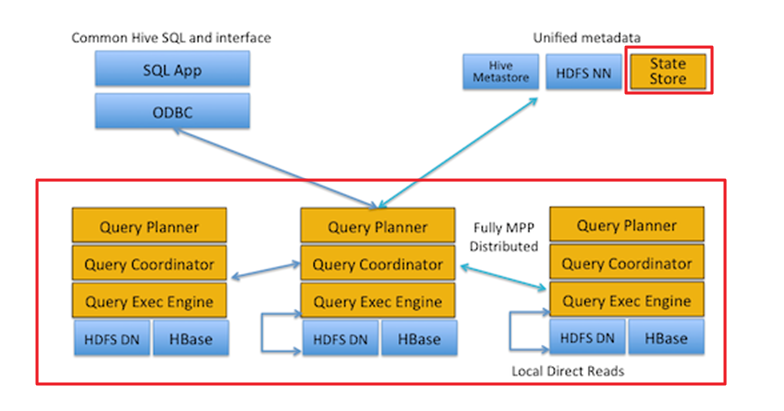

## Hadoop Eco-System
-

## Apach Hive 란
HDFS나 HBase 와 같은 대량의 데이터 원본을 HiveQL이라고 불리는 쿼리 언어로, <b>HDFS에 저장된 데이터를 분석</b>하기 위해 사용하는 기술이다.

## 분석기술의 등장 배경
Hadoop의 사용자 그룹은 MapReduce 프레임워크를 사용함에 있어서 
 - 사용성이 불편
 - 처리속도 느림
위와 같은 단점을 해결하고자, Pig나 Hive와 같은 플랫폼이 등장했다. 

## Pig vs Hive
공통점
 - 2008년도 등장
 - High-Level 언어
 - 내부적으로 MapReduce를 사용
 - <b>데이터 조회를 위한 인터페이스를 위한 기술이어서 대용량 데이터 분석에 속도를 높이진 않는다.</b>

차이점
 - Pig
    - 절차적
 - Hive
    - SQL과 비슷한 선언적 형태

## HBase의 등장
Pig, Hive가 데이터 분석에 속도를 높이는 기술이 아님에 따라 컬럼 기반 NoSQL인 HBase가 등장 했다. 
HBase의 Key-Value 맵핑된 데이터에 대한 빠른 입출력으로 인해 Hadoop의 실시간 데이터 처리 환경을 제공한다. HBase는 구글의 BigTable 논문을 바탕으로 제작되었다.

- [Bigtable: A Distributed Storage System for Structured Data, 2006](https://static.googleusercontent.com/media/research.google.com/ko//archive/bigtable-osdi06.pdf)

## HDFS
Google에서 발표한 GFS(Google File System) 논문을 바탕으로 구현되었음. GFS는 웹페이지 정보를 크롤링해 저장할 수 있는 고유의 분산 파일 시스템의 필요해 의해 만들어졌다. 

- [The Google File System, 2003](https://static.googleusercontent.com/media/research.google.com/ko//archive/gfs-sosp2003.pdf)

## Cloudera Impala
Impala도 Google의 영향을 받았으며, 이는 2010년도 Google의 Dremel 논문을 바탕으로 제작 되었다. 
Impala는 Apache라이선스를 가진 오픈소스이며, HDFS에서 동작하는 '즉각적인 실시간 SQL 질의 시스템(interactive/real-time SQL queries system)' 이다. 
또한 HBase와도 연동이 가능하다.
단, Impala는 Cloudera의 Hadoop을 써야하는 제약이 있다. 
Impala는 인터페이스로 [Hive-QL](https://cwiki.apache.org/confluence/display/Hive/LanguageManual) 을 채택한다.

### Hive-SQL의 사용
Impala는 모든 Hive-SQL을 지원하지 않는다. 즉 Hive에서 사용가능한 문법이 Impala보다 많다.

- [SQL Difference Between Impala and Hive](https://www.cloudera.com/documentation/enterprise/5-5-x/topics/impala_langref_unsupported.html)
- [Dremel: Interactive Analysis of Web-Scale Datasets, 2011](https://static.googleusercontent.com/media/research.google.com/ko//pubs/archive/37217.pdf)

## Impala vs Hive
공통점
 - Hive-SQL 사용

차이점
 - 실시간성(모니터를 바라보면서 결과를 기다릴 수 있는 정도의 소요시간)
    - Impala는 응답시간 최소화를 위해 데이터 접근시 고유의 분산 질의 엔진 사용
        - 분산 질의 엔진은 클러스터 내 모든 데이터 노드에 설치
    - Hive는 MapReduce 프레임워크를 사용해 데이터 접근

## Impala 아키텍처
Impala는 크게 impalad와 impala state store라는 프로세스로 구성되어 있다.
 - impalad: 분산 질의 엔진 역할을 담당하는 프로세스, 각 데이터노드 위에서 질의에 대한 plan 및 질의 처리작업 실행
 - impala state store: 각 데이터 노드에서 수행되는 impalad에 대한 메타데이터 유지

### Scale Out
Hadoop 클러스터와 같이 수평적 확장이 가능하다. 데이터 노드가 추가될때 impalad 프로세스를 해당 서버에서 실행하기만 하면 자연스럽게 확장된다. 실행시 state store에 메타데이터 정보가 업데이트 될 것이다. 

### Failover
Impala는 Hive 와 HBase에 저장되엉 있는 데이터를 분석한다. 그리고 그 둘이 사용하는 HDFS는 Replication을 통해 어느정도의 faioover를 제공한다. 그래서 Impala는 데이터 블록의 replica가 존재하고, 최소 한 개 이상의 impalad 프로세스가 존재한다면 질의 수행이 가능하다.

### SPOF(Single Point of Failure)
HDFS를 사용하는 시스템의 가장 큰 문제는 네임노드가 SPOF라는 점인데, Impala도 마찬가지이다. 
데이터 블록의 위치를 알 수 없으면 질의수행을 할 수가 없다. 

## 참고자료
- [Naver D2: Hadoop에서의 실시간 SQL 질의: Impala](http://d2.naver.com/helloworld/246342)
- [Cloudera: Impala Guide](https://www.cloudera.com/documentation/enterprise/5-5-x/topics/impala.html)