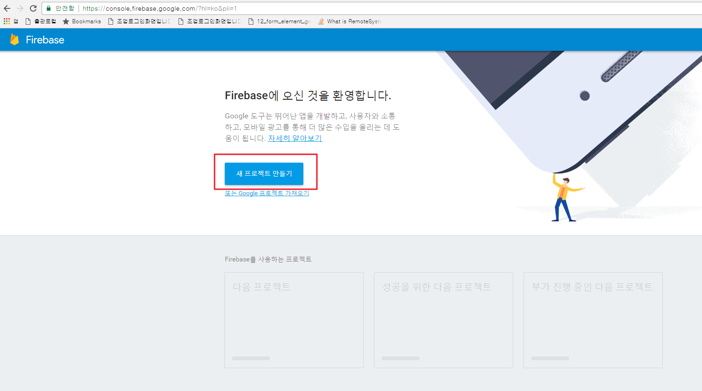
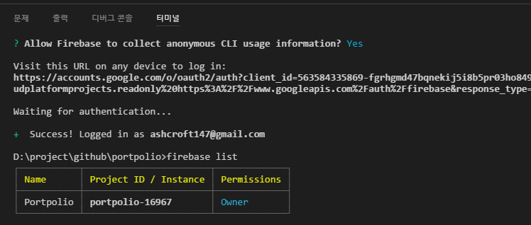
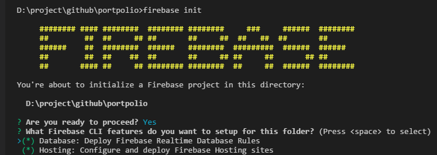
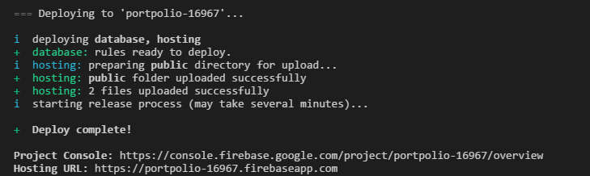
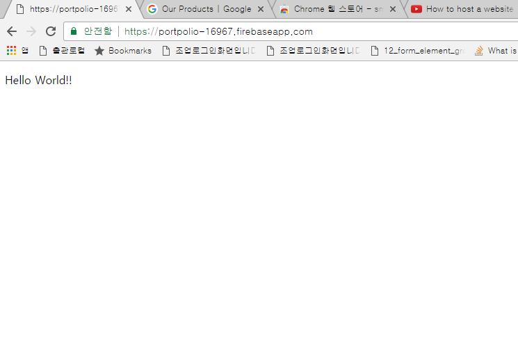

## Create New Project with Firebase
 - Firebase 콘솔에 접속하여 새 프로젝트 만들기 Click

 - Project 명과 지역 선택
 - 개요 페이지에서 웹 앱에 Firebase 추가 선택

## npm을 사용하여 Firebase CLI 설치
~~~
$ npm install -g firebase-tools
~~~
 - globally firebase cli를 설치하여 어느 디렉토리에서든 firebase 명령어를 실행할 수 있다.
 - 위 명령어를 재실행하면 firebase cli를 최신버전으로 업데이트 한다.

## Google 계정으로 로그인
~~~
$ firebase login
~~~
 - Client PC를 Firebase 계정에 연결하고 프로젝트에 대한 엑세스 허용
 - firebase list 명령어를 실행하여 Firebase 프로젝트 목록이 표시되는지 확인

 

 ## 사이트 초기화
  - 프로젝트의 루트 디렉토리에서 다음의 명령어를 실행한다. 
 ~~~
 $ firebase init
 ~~~
 

 - Database 및 Hosting을 선택하여 설정

## 사이트 deploy
 - 사이트를 firebase에 배포하기 위해 다음의 명령어를 실행
 ~~~
 $ firebase deploy
 ~~~
 - 이렇게 하면 프로젝트가 <YOUR-FIREBASE-APP>.firebaseapp.com (https://portpolio-16967.firebaseapp.com)에 배포된다.
 

## 사이트 접속
 - https://portpolio-16967.firebaseapp.com 에 접속하면 다음과 같이 Hello World가 실행된다.
 