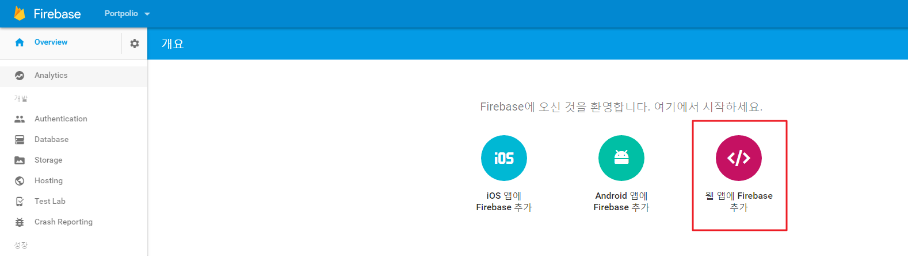
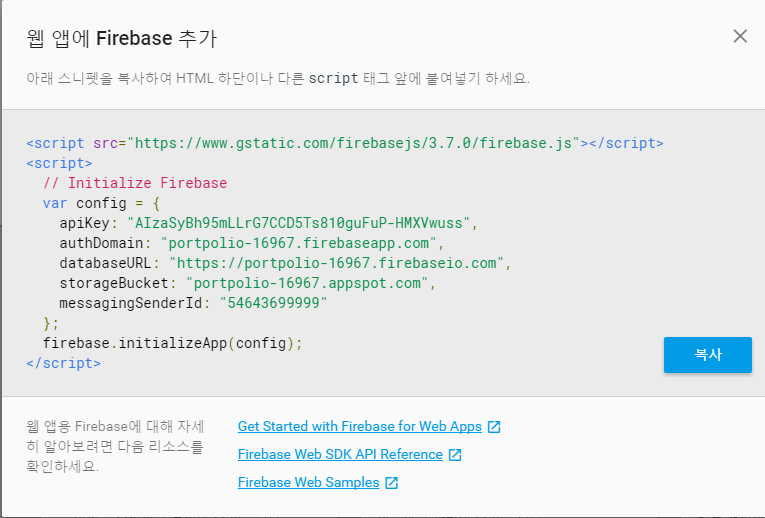

## create-react-app 사용 project 구성

## Firebase 초기화
 - config 선언
 
 - config 변수값을 복사해 myapp의 index.js 에 붙여넣는다.
 

 - firebase 초기화
    -  initializeApp(options, name) 메소드사용
        - paramters 
            - options: 반드시 값이 존재해야 하고, Object 타입이다. app 서비스를 위한 config 값을 입력한다.
            - name: Optional이고 String 타입이다. firebase app의 이름을 설정한다.
        - Returns: non-null firebase.app.App
~~~
firebase.initializeApp(config);
~~~

## Reference
 - [Firebase Web API](https://firebase.google.com/docs/reference/js/)

