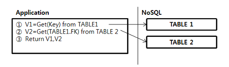
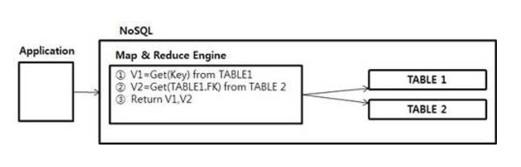

## NoSQL 데이터 모델
    - NoSQL 데이터 모델이란, Put/Get의 단순한 DBMS에 대해서 다양한 형태의 Query를 제공하기 위한 테이블 디자인 기법을 의미한다. 
 1. Key/Value Store
  - Oracle Coherence, Redis
 
 2. Ordered Key/Value Store
  - 내부적으로 Key를 순서로 Sorting해서 저장
  - NoSQL은 Ordery by 기능이 없기때문에 Sorting해서 출력시 필요
  - Apache의 Hbase, Cassandra 
 
 3. Document Key/Value Store
  - Key를 사용하는 것은 동일하나 Value에 Document 라는 타입을 저장한다. 
  - Document는 XML, JSON, YAML 과 같은 구조화된 데이터 타입이다.
  - Sorting, Join, Grouping 등의 기능 제공
  - MongoDB,CouchDB,Riak 

## NoSQL과 RDBMS의 차이
 - NoSQL은 데이터를 저장하고, Key에 대한 Put/Get만 지원한다.
 - NoSQL에서는 Sorting, Join, Grouping, Range, Index에 대한 기능을 지원하지 않으므로 
   NoSQL Data Modeling Pattern을 통해서 구현할 수 있다.

## When embeded, When Reference
 - embeded
 ~~~
 {
     "sesseionId": "1",
     "speakers": [
         {
            embedded
         },
         {
            embedded
         }
     ]
 }
 ~~~
 - when ?
    - query(select, update) operation이 동시에 일어나는 경우의 data
    - 하위의 document가 상위 document에 의존적 인 경우의 data
        - 예를들어, 네 명의 가족이 음식을 주문하는 경우 각 구성원의 메뉴는(하위 document)는 주문에(상위 document) 의존적
    - 1:1 관계에 있는 data의 경우
        - 걸그룹의 멤버는 각각 profile을 반드시 갖고 있고, 이러한 1:1의 관계에 있는 sub object는 embeded되어야 한다.
    - Similar volatility: 비슷한 시점에 동시에 바뀌는 Data의 경우
        - 예를들어 email과, socialId 객체가 있다고 가정하면 이 둘은 거의 바뀌지 않고 바뀌는 주기가 비슷하다.

 - 성능은 ?
    - embeded document는 data를 가져오거나 put하는 경우 하나의 document에만 query를 실행하므로 더 좋은 성능을 낸다.

 - reference
 ~~~
 {
     "sesseionId": "1",
     "speakers": [{"id": 1}}, {"id": 2}}]
 },
 //reference
 {
    "id": 1, 
 },
 reference
 {
    "id": 2
 }
 ~~~

 - when ?
    - one-to-many의 관계에 있으면서 sub document로 있는 경우 그 데이터가 무한정 증가하는 경우
        - 예를들어, SNS의 댓글인 경우에 특정 document에 embeded 해버리면, comment가 증가할수록 Main document는 성능이 당연히 떨어질수 밖에 없다.
    - many-to-many의 관계
        - 예를들어, 여러 강사가 있고 각각의 강사가 여러개의 강좌를 강의한다고 하면 이런 경우 강사랑, 강좌는 서로 document를 분리하는게 낫다
    - 서로연관된 데이터지만 서로다른 volatility를 갖고 있는 데이터의 경우
    - 참조되는 document의 entity가 다른 document에 의해서 key entity로 사용되는 경우 분리 해야 한다. 

 - 성능은 ?
    - embeded 보다는 낮지만, database를 작게 관리할 수 있어 효율적이다.

 - embeded + referencing

## Normalization, Denomalization
- Nomalization
    - document를 따로 관리하는 것을 의미
        - 전체 document의 사이즈가 클 경우 특정 entity참조시 성능이 느려질 수 있다.
        - 여러개의 document에서 entity를 불러와 조인할 경우 쿼리의 복잡도가 증가할 수 있다.
        - 장점: storage space를 아낄 수 있다.
- Denomalization
    - 쿼리의 성능을 개선하기 위해 동일한 데이터를 여러 document에 복제하는 것을 의미
    - RDBMS에서 Join을 지원하기 위한 디자인패턴이다. 
        - 장점: read speed가 올라간다. 그리고 쿼리 로직이 단순해 진다(단일 테이블)
        - 단점: 데이터 일관성 문제 발생, 스토리지의 사이즈가 증가한다. 

## Aggregation
 - NoSQL은 Schema less 하기 때문에, Key만 동일하다면 Value는 서로 타입이 다르고 Row에 사용하는 컬럼이 달라도 상관없다. 이러한 특성을 사용해 1:N의 복잡한 테이블을 Entity의 통합을 통해 하나의 테이블로 표현할 수 있다.
    - Join을 대체

## Application Side Join

 - 장점: 스토리지 사이즈 줄일수 있다.
 - 단점: 필요한 데이터 만큼 I/O 발생

## Severside Join
 - 서버에서 Map & Reduce 엔진을 통해 Join실행

 - 단점: 서버 부하 발생

## Homogeneous, Heterogeneous
 - Homogeneous 
    - database: same software, same hardware
    - data: Red, Green, Purple
 - Heterogeneous
    - database: different dbms, different hardware
    - data: White, 1/2/2015, 424291.23

## keyword search

## Telemetry
 - one document per reading
 ~~~
 {
     "deviceId": ...,
     "timestamp": "",
     "reading": 123
 }
 ~~~

 - one document per time period, per device
  ~~~
 {
     "deviceId": ...,
     "timestamp": "",
     "readings": 
     [
        {"minute": 0, "reading": 123},
        ...
     ]
 }
 ~~~

deviceId나, timestamp와 같은 metadata 들이 아래코드는 한번만 입력된다. 

## Atomic aggregation
 - 두 개 이상의 테이블을 업데이트 할때 테이블 데이터의 원자성 확보를 위한 패턴이다. 
   결국 테이블을 합쳐서 원자성을 확보하는 것을 의미하고 이를 통해 트랜잭션 불일치 문제를 해결할 수 있다. 

## Index Table
    - NoSQL은 Index 가 없기 때문에, Key 이외의 필드로 검색이 아예 안되거나 Full Scan이 될 수 있다. 이를 해결하기 위해 index를 추가해 index 테이블을 만들어 Key이외의 필드에 대해서 검색성능을 향상 시킬 수 있다.

## Composite Key

## 참고자료
 - [조대협의 블로그](http://bcho.tistory.com/665)
 - [MS Build](https://www.youtube.com/watch?v=-o_VGpJP-Q0)