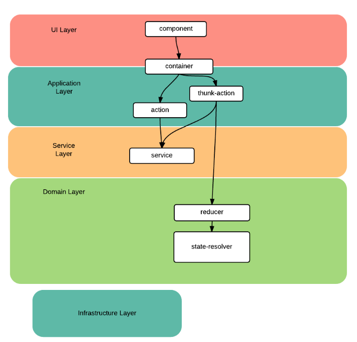

## Redux란 ?
 - Javascript Application에서 사용할 수 있는 예측가능한 상태 컨테이너로 하나의 store 안의 JSON 객체 트리에 저장된다.
 - React에서 Flux 아키텍처를 편하게 사용할 수 있도록 해주는 라이브러리 이다.
 - 시간 여행 디버거와 결합해 실시간 코드 수정을 가능하게 한다.
    
 - 단일 store, 다수 reducer 정책
 	- 상태처리는 reducer가 담당하고, 각 reducer가 처리하는 상태는 최상위 reducer가 상태 Tree를 만들어 store를 구독하는 구독자에게 전달한다.
 - 단, 하나의 store 정책은 강제적이지 않고 여러 store로 구현도 가능하다.

## Redux가 만들어진 배경
 - 자바스크립트로 개발된 SPA가 복잡해짐에따라 많은 상태를 Javascript에서 관리할 필요가 생겼습니다.   
 (※ 상태: Server Response, Cache, 서버 저장전의 데이터, UI상태 - 선택된 탭, 로딩, 활성화 Route 등등)

---

## 의존모듈 설치
1. redux: predictable state container for JS Apps
1. react-redux: React 바인딩

## Middleware
### redux-thunk
 - thunk를 사용함으로써 function을 return하는 action creator이다.
 - 비동기 Action을 만들기 위해 사용
### redux-promise
 - FSA를 사용하는 Promise Middleware
 - [redux-promise on github](https://github.com/acdlite/redux-promise)
### redux-logger
 - 발생한 React의 Action과 그에 따른 다음의 state에 대한 기록 도구
 - [redux-logger on github](https://github.com/evgenyrodionov/redux-logger)

## 리덕스 레이어
 - UI에서 발생하는 인터랙션을 해석해 어떤 Action에 결합할지를 결정하는 것은 Container에게 맡겨야 한다. -> 리액트 컴포넌트와 리덕스 시스템의 결합도를 낮출 수 있다.

## Action
 - Action을 통해 store의 state를 바로 변경하지 않고 Action 객체를 통해서 변경을 명시한다.

## Reducer
 - Reducer는 이전의 상태와 액션을 수신받아 다음 상태를 return하는 pure function 이다.  
   → 이전상태를 변경하지 않고 새로운 객체를 생성해서 반환한다.
   → (state, action) => state
   → 순수하지 않은 리듀서 구현은 시간 여행, 기록/재생, 핫 로딩과 같은 개발 지원 기능을 망가뜨립니다. 
 - store에 저장된 상태 트리를 변경하는 일은 action 객체를 통해 일어난다. 여기서 Reducer는 Action이 store의 상태를 어떻게 바꾸는지를 구체적으로 정의한 객체이다.
 - App이 커질수록 Store의 state가 늘어나고, store내의 state를 각각 관리하는 Reducer를 여러개로 쪼개서 제작하는것이 좋다.

## Redux Data Flow
Redux 아키텍처는 엄격하게 단방향의 데이터 흐름을 갖습니다. 

1. store.dispatch(action)을 호출
 - action은 type과 optional한 payload 정보를 지닌 object이다.

2. Redux store가 Reducer 호출
 ~~~
  // 이전 state
 let previousState = {
   visibleTodoFilter: 'SHOW_ALL',
   todos: [{
     text: 'Read the docs.',
     complete: false
   }]
 };

 // Action
 let action = {
   type: 'ADD_TODO',
   text: 'Understand the flow.'
 };

 // reducer에 의해 next state 반환
 let nextState = todoApp(previousState, action);
 ~~~

3. root reducer가 각 reducer의 출력을 합쳐서 하나의 상태 트리로 만듭니다.
 - combineReducers()가 편리한 헬퍼 유틸리티이긴 하지만, 반드시 써야 하는건 아닙니다; 원하신다면 루트 리듀서를 직접 작성하세요!
 ~~~
  function todos(state = [], action) {
   // Somehow calculate it...
   return nextState;
 }

 function visibleTodoFilter(state = 'SHOW_ALL', action) {
   // Somehow calculate it...
   return nextState;
 }

4. Redux 스토어가 루트 리듀서에 의해 반환된 상태 트리를 저장합니다.
 이 새 트리가 여러분의 앱의 다음 상태입니다! store.subscribe(listener)를 통해 등록된 모든 리스너가 불러내지고 이들은 현재 상태를 얻기 위해 store.getState()를 호출할겁니다. 이제 새로운 상태를 반영하여 UI가 변경될겁니다. 여러분이 React Redux으로 바인딩을 했다면, 이 시점에 component.setState(newState)가 호출됩니다.

 let todoApp = combineReducers({
   todos,
   visibleTodoFilter
 });
 ~~~

## React App 연결

## 상태트리 설계
Redux는 reducer를 트리 구조로 분리함으로써 상태 관리 책임을 분산한다. 
분리된 상태는 combineReduce 함수로 조합하여 최상위 리듀서가 시스템의 단일 상태 트리로 조합한다.<b> 여기서 시스템의 상태구조 확인 가능</b>

### UI 와 상태 트리의 연결
~~~
{
    header: {},
    navigator: {},
    contents: {},
    footer: {}
}
~~~
UI는 변경이 잦은 부분이다. 이를 Reducer에 연결하면 불안정해질 수 있다.

### 기능 단위 상태 트리 설계
~~~
{
    toolbar : {
        isShown: false
    },
    components : {
        order: ["comp_1", "comp_2"]
        compMap :{
            "comp_1": {
                ui : {},
                doc : {}
            },
            "comp_2": {
                ui : {},
                doc : {}
            },
        }
    },
    metaData : {
        document : {}
        release : {}
    }
} 
~~~
- 기능 기준으로 상태트리를 설계하면, UI와의 관계를 약하게 할 수 있다.
- 기능으로 상태 트리를 설계하면, 화면 기능에 대한 정보를 요약해서 보여줄 수 있다.

## Presentational Component and Container Component
리덕스는 모든 상태를 reducer, 즉 store에서 관리할 것을 강제하지 않는다.
Component는 지역 상태, Reducer는 전역 상태를 관리해야 효율적이고 유연한 Application이 된다. 

### Presentational Component
- 화면에 Component를 어떻게 렌더링 할지 결정
- 사용자의 요청을 받아 상위 Component로 전달
~~~
import React, { PropTypes } from 'react'

const Link = ({ active, children, onClick }) = {
  if (active) {
    return <span{children} Redux와 React Component를 연결하는 레이어에 불과하다.
~~~
import { connect } from 'react-redux'
import { setVisibilityFilter } from '../actions'
import Link from '../components/Link'

// store -> React Component
const mapStateToProps = (state, ownProps) = {
  return {
    active: ownProps.filter === state.visibilityFilter
  }
}

// React Component -> store
const mapDispatchToProps = (dispatch, ownProps) = {
  return {
    onClick: () = {
      dispatch(setVisibilityFilter(ownProps.filter))
    }
  }
}

const FilterLink = connect(
  mapStateToProps,
  mapDispatchToProps
)(Link)
~~~

connect 함수는 React Component와 Redux를 연결한다.

## 전역상태 vs 지역상태

### 전역상태
- 영속성을 갖는 도메인 데이터
    - 어플리케이션 생애주기 동안 가져야 하는 데이터
- 서로 다른 컨테이너 간에 공유해야 하는 상태
    - 포커스의 경우 하나의 컴포넌트만 포커스를 가져야 하고 이전 포커스를 삭제해야 하므로 상태 공유 필요

### 지역 상태
- 컴포넌트 내부에 캡슐화할 수 있는 상태

## 리덕스를 포함하는 레이어(참고)

### UI 레이어
UI 레이어는 사용자에게 정보를 보여준다. 지역 상태와 관련한 사용자의 요청을 해석하여 상위 컴포넌트 혹은 컨테이너로 전달한다. 컨테이너는 UI를 리덕스 시스템과 연결하는 연결 고리 역할을 한다.

### 애플리케이션 레이어
애플리케이션의 활동을 조율하는 얇은 레이어 UI 레이어에서 넘어온 사용자 요청을 해석하여 적절한 레이어로 전달한다. 어떤 상태도 직접 보관하거나 관리하지 않는다. 시스템에 사이드 이펙트를 만드는 외부와의 커뮤니케이션 요청을 처리하는 로직은 애플리케이션 레이어에 위임한다. 사용자의 요청을 해석하는 로직이 복잡하거나, 외부에서 넘겨받은 데이터를 가공해야 하는 등의 복잡한 연산을 수행해야 한다면, 관련 로직을 캡슐화하여 서비스 레이어에 위임할 수 있다.

### 서비스 레이어
XHR을 이용한 외부 데이터 요청, 외부 데이터 변환 같은 애플리케이션 레이어의 임무 수행을 지원하는 모듈이 위치한다. 리듀서에서 사이드 이펙트를 불러오는 외부 데이터 요청을 금지하는 리덕스의 특성상, 외부의 리소스를 요청하는 처리를 이 레이어에서 담당한다.

### 도메인 레이어
도메인 정보를 가지고 있으며, 생성, 변경, 삭제 등을 담당한다. 전역 상태를 관리하고 처리하며, 처리한 결과를 통지한다. 업무 규칙을 관리하며 전역 상태를 처리할 때 적절한 업무 규칙을 적용한다. 리덕스의 특성상 영속성과 관련한 책임은 도메인 레이어에서 수행하지 않는다.

### 인프라스트럭쳐 레이어
다른 레이어 모두를 지원하는 라이브러리로 동작한다. 레이어 간의 통신을 제공하고 전역 상태의 영속성을 책임진다. 사용자 인터페이스 레이어에서 사용하는 내/외부 라이브러리를 포함한다.

## 설치하기
~~~
npm install --save redux react-redux
~~~

## 참고자료
 - [Using with React Redux](http://redux.js.org/docs/basics/UsageWithReact.html)
 - [리덕스 패턴(Redux pattern)](https://www.zerocho.com/category/React/post/57b60e7fcfbef617003bf456)
 - [redux-thunk](https://www.npmjs.com/package/redux-thunk)
 - [Hot Reloading](https://facebook.github.io/react-native/blog/2016/03/24/introducing-hot-reloading.html)
 - [Time travel debugging](http://bestalign.github.io/2015/10/27/redux-hot-reloading-and-time-travel-debugging/)
 - [리덕스(Redux) 애플리케이션 
설계에 대한 생각](http://m.post.naver.com/viewer/postView.nhn?volumeNo=4575578&memberNo=1377642#)
 - [Redux 문서](https://deminoth.github.io/redux/)
 - [제작자로부터 Redux 배우기](https://egghead.io/courses/getting-started-with-redux)
 - [React Ecosystem and Middleware](https://deminoth.github.io/redux/introduction/Ecosystem.html)