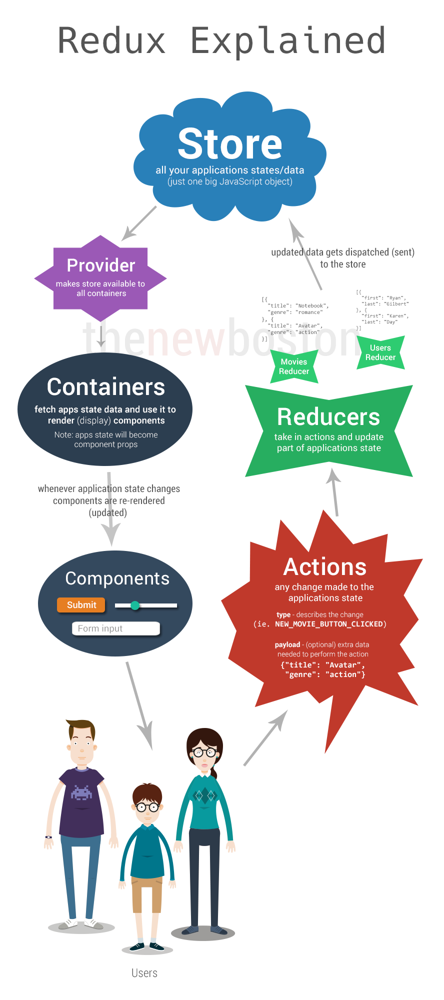

## Redux란 ?
 - Javascript Application에서 사용할 수 있는 예측가능한 상태 컨테이너로 하나의 store 안의 JSON 객체 트리에 저장된다.
 - React에서 Flux 아키텍처를 편하게 사용할 수 있도록 해주는 라이브러리 이다.
 - 시간 여행 디버거와 결합해 실시간 코드 수정을 가능하게 한다.
    

## Redux가 만들어진 배경
 - 자바스크립트로 개발된 SPA가 복잡해짐에따라 많은 상태를 Javascript에서 관리할 필요가 생겼습니다.   
 (※ 상태: Server Response, Cache, 서버 저장전의 데이터, UI상태 - 선택된 탭, 로딩, 활성화 Route 등등)

---

## 의존모듈 설치
1. redux: predictable state container for JS Apps
1. react-redux: React 바인딩

## Middleware
### redux-thunk
 - thunk를 사용함으로써 function을 return하는 action creator이다.
 - 비동기 Action을 만들기 위해 사용
### redux-promise
 - FSA를 사용하는 Promise Middleware
 - [redux-promise on github](https://github.com/acdlite/redux-promise)
### redux-logger
 - 발생한 React의 Action과 그에 따른 다음의 state에 대한 기록 도구
 - [redux-logger on github](https://github.com/evgenyrodionov/redux-logger)

## 리덕스 레이어
 - UI에서 발생하는 인터랙션을 해석해 어떤 Action에 결합할지를 결정하는 것은 Container에게 맡겨야 한다. -> 리액트 컴포넌트와 리덕스 시스템의 결합도를 낮출 수 있다.

## Action
 - Action을 통해 store의 state를 바로 변경하지 않고 Action 객체를 통해서 변경을 명시한다.

## Reducer
 - Reducer는 이전의 상태와 액션을 수신받아 다음 상태를 return하는 pure function 이다.  
   → 이전상태를 변경하지 않고 새로운 객체를 생성해서 반환한다.
   → (state, action) => state
   → 순수하지 않은 리듀서 구현은 시간 여행, 기록/재생, 핫 로딩과 같은 개발 지원 기능을 망가뜨립니다. 
 - store에 저장된 상태 트리를 변경하는 일은 action 객체를 통해 일어난다. 여기서 Reducer는 Action이 store의 상태를 어떻게 바꾸는지를 구체적으로 정의한 객체이다.
 - App이 커질수록 Store의 state가 늘어나고, store내의 state를 각각 관리하는 Reducer를 여러개로 쪼개서 제작하는것이 좋다.

## Redux Data Flow
Redux 아키텍처는 엄격하게 단방향의 데이터 흐름을 갖습니다. 

1. store.dispatch(action)을 호출
 - action은 type과 optional한 payload 정보를 지닌 object이다.

2. Redux store가 Reducer 호출
 ~~~
  // 이전 state
 let previousState = {
   visibleTodoFilter: 'SHOW_ALL',
   todos: [{
     text: 'Read the docs.',
     complete: false
   }]
 };

 // Action
 let action = {
   type: 'ADD_TODO',
   text: 'Understand the flow.'
 };

 // reducer에 의해 next state 반환
 let nextState = todoApp(previousState, action);
 ~~~

3. root reducer가 각 reducer의 출력을 합쳐서 하나의 상태 트리로 만듭니다.
 - combineReducers()가 편리한 헬퍼 유틸리티이긴 하지만, 반드시 써야 하는건 아닙니다; 원하신다면 루트 리듀서를 직접 작성하세요!
 ~~~
  function todos(state = [], action) {
   // Somehow calculate it...
   return nextState;
 }

 function visibleTodoFilter(state = 'SHOW_ALL', action) {
   // Somehow calculate it...
   return nextState;
 }

4. Redux 스토어가 루트 리듀서에 의해 반환된 상태 트리를 저장합니다.
 이 새 트리가 여러분의 앱의 다음 상태입니다! store.subscribe(listener)를 통해 등록된 모든 리스너가 불러내지고 이들은 현재 상태를 얻기 위해 store.getState()를 호출할겁니다. 이제 새로운 상태를 반영하여 UI가 변경될겁니다. 여러분이 React Redux으로 바인딩을 했다면, 이 시점에 component.setState(newState)가 호출됩니다.

 let todoApp = combineReducers({
   todos,
   visibleTodoFilter
 });
 ~~~

## React App 연결
React는 꼭 React에서만 쓰이는 container가 아니다. Redux는 React, Angular, jQuery등에서도 사용할 수가 있다.
하지만 Redux는 액션에 반응해서 상태를 변경시키기 때문에, React에 잘 어울린다. 

### Smart(Container) Comonent and Dumb(Presentational) Component
|   | SMART | DUMB |
 ------------ | :-----------: | -----------: |
위치       |         Route Component        | 말단 컴포넌트|
Redux연관       |   Yes    |         No |
데이터를 읽기위해   |     Redux구독      |        props에서 데이터 읽음 |
데이터를 바꾸기 위해 | Redux Action을 보냄 |  props에서 콜백 호출      

### Redux와 연결하기
 1. react-redux에서 Provider를 읽어와서 <Provider>로 root Component를 감싸주어야 한다.
  - 이렇게 하면 App 내의 모든 컴포넌트에서 store 인스턴스를 사용할 수 있게 된다. 
 ~~~
 index.js

import React from 'react';
import { createStore } from 'redux';
import { Provider } from 'react-redux';
import App from './containers/App';
import todoApp from './reducers';

let store = createStore(todoApp);

let rootElement = document.getElementById('root');
React.render(
  // React 0.13의 이슈를 회피하기 위해 
  // 반드시 함수로 감싸줍니다.
  <Provider store={store}>
    {() => <App />}
  </Provider>,
  rootElement
);
 ~~~

  2. Redux와 연결하고 싶은 컴포넌트를 react-redux의 connect() 함수로 감싸준다. -> Router Component나 최상위 컴포넌트만 연결 -> 너무 깊은 연결시 데이터 흐름의 추적이 어려움 
   - mapStateToProps(state, ownProps): store의 state를 컴포넌트의 props속성에 매피
   - mapDispatchToProps(dispatch, ownProps): 컴포넌트의 특정 함수형 props를 실행했을때, 개발자가 지정한 action을 dispatch 하도록 설정ㅑㅑㅑㅑㅑㅓㅓ,

## 설치하기
~~~
npm install --save redux react-redux
~~~

## 참고자료
 - [Using with React Redux](http://redux.js.org/docs/basics/UsageWithReact.html)
 - [리덕스 패턴(Redux pattern)](https://www.zerocho.com/category/React/post/57b60e7fcfbef617003bf456)
 - [redux-thunk](https://www.npmjs.com/package/redux-thunk)
 - [Hot Reloading](https://facebook.github.io/react-native/blog/2016/03/24/introducing-hot-reloading.html)
 - [Time travel debugging](http://bestalign.github.io/2015/10/27/redux-hot-reloading-and-time-travel-debugging/)
 - [리덕스(Redux) 애플리케이션 
설계에 대한 생각](http://m.post.naver.com/viewer/postView.nhn?volumeNo=4575578&memberNo=1377642#)
 - [Redux 문서](https://deminoth.github.io/redux/)
 - [제작자로부터 Redux 배우기](https://egghead.io/courses/getting-started-with-redux)
 - [React Ecosystem and Middleware](https://deminoth.github.io/redux/introduction/Ecosystem.html)
 - [Thinking in React](https://facebook.github.io/react/docs/thinking-in-react.html)