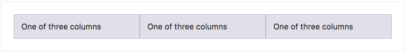
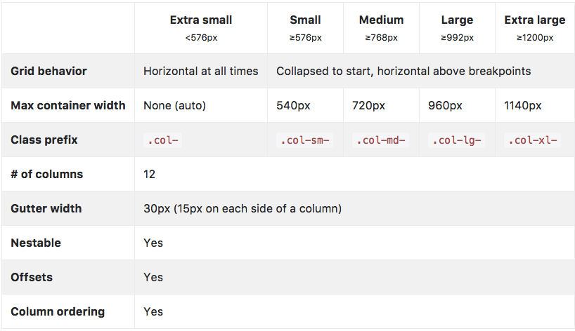
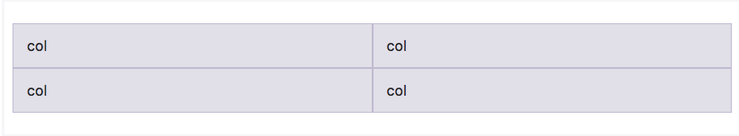
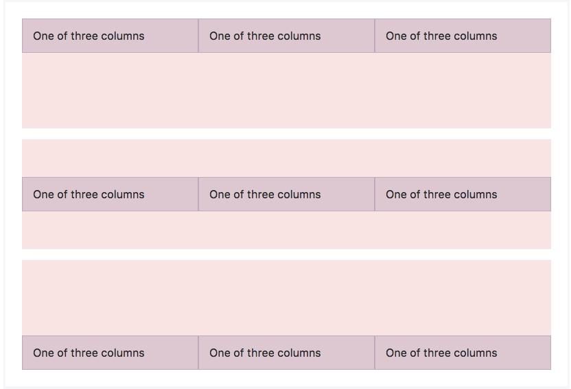
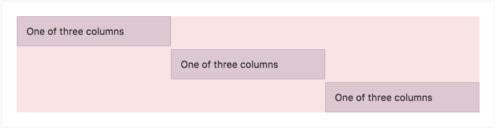

## Grid System ?
> 뷰포트의 크기가 증가함에 따라 12 열이 적절하게 확대되는 반응형, 모바일 우선의 유동 그리드 시스템이다. [^viewport]

grid system을 사용하는 엘리먼트는 .container속성을 가진 부모 엘리먼트를 가진다.
각각의 행은 .row 를 가진다.

 - container는 container 에 속한 엘리먼트들을 가운데 정렬하는 수단을 제공한다. 
    - .container는 fixed width로 표시할때 사용. 
    ~~~
    @media (min-width: 902px) { 
        #about > .container {
            max-width: 800px;
        }
    }
    ~~~
    - .container-fluid는 full width로 표시할때 사용
 - .row 안에 Grid System이 존재하고 수평해야 한다. 
 

## Grid Options
px은 container의 width를 지정할때 사용되고, container 내의 엘리먼트에 대해서는 em 혹은 rem을 사용한다. 

## Break New Line in a row class
.w-100을 break row하고 싶은 위치에서 사용하면 동일한 .row의 엘리먼트들이 new line으로 나뉘어 진다.

~~~

  
col

  
col

  

  
col

  
col

~~~

## Responsive Classes
 - Bootstrap은 다섯가지 tier의 컬럼에 대한 반응형 웹 디자인을 위한 class 들을 갖고 있다. 
    - extra small
    - small
    - medium
    - large
    - extra large

 - Mix and Match: 다양한 tier의 디바이스 각각에 적용가능하게 하기 위해서 여러 class 들을 조합해 주어야 한다.  
 ~~~
 <!-- mobile: 각 div 엘리먼트는 50%의 크리, desktop: 각 33.3% 사이즈 -->
    

        
.col-6 .col-md-4

        
.col-6 .col-md-4

        
.col-6 .col-md-4

    

 ~~~

## Alignment
 -  Vertical Alignment
 
 ~~~
 

  

    

      One of three columns
    

    

      One of three columns
    

    

      One of three columns
    

  

  

    

      One of three columns
    

    

      One of three columns
    

    

      One of three columns
    

  

  

    

      One of three columns
    

    

      One of three columns
    

    

      One of three columns
    

  

 ~~~

 - Horizontal alignment
  
 ~~~
 

  

    

      One of three columns
    

    

      One of three columns
    

    

      One of three columns
    

  

 ~~~

### 참고자료
 - [부트스트랩 그리드 시스템](http://the3.tistory.com/41)
 - [Bootstrap Doc](https://v4-alpha.getbootstrap.com/layout/grid/)

### 각주
[^viewport]: 뷰포트는 어떤 
