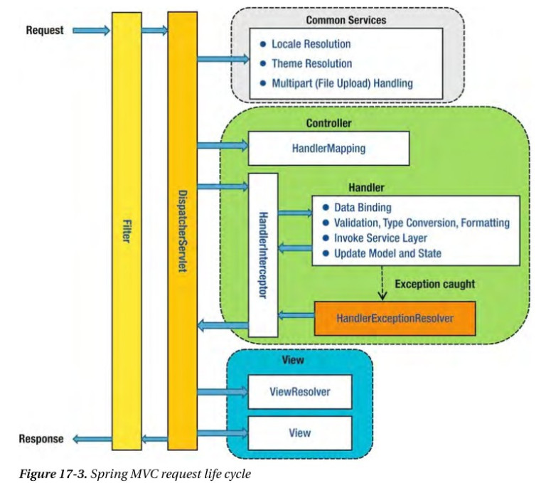

# Spring Request Lifecycle

## Filter

## dispatcher-servlet
request를 분석하여 request에 맵핑되는 controller에 연결하는 역할을 한다. 

## Handler Mapping
이 컴포넌트는 클라이언트에서 요청한 URI를 어떤 Controller가 처리할지 결정후 맵핑한다. 
mapping property를 이용하여 패턴과 컨트롤러 사이의 맵핑을 지정한다. 

- SimpleUrlHandlerMapping: 패턴과 컨트롤러의 이름을 비교 URL가 패턴에 매칭될 때 지정한 컨트롤러를 사용 한다.
    - 경로 패턴 문자
        - ?: 1개의 문자와 매칭
        - *: 0개 이상의 문자와 매칭
        - **: 0개 이상의 디렉토리와 매칭pull
- BeanNameUrlHandlerMapping: 요청 URL와 동일한 이름을 가진 Controller 빈을 매핑 한다.
- ControllerClassNameHandlerMapping: URL와 매칭 되는 클래스 이름을 갖는 빈을 컨트롤러로 사용. 잘 쓰이지 않음
- DefaultAnnotationHandlerMapping: @RequestMapping 어노테이션을 이용하여 요청을 처리할 컨트롤러를 구한다.
~~~
<bean id="beanNameUrlMapping" class="org.springframework.web.servlet.handler.SimpleUrlHandlerMapping">
    <property name="mappings">
        <value>
            /**/*.mvc=controller
        </value>
    </property>
</bean>
~~~

## Handler Interceptor

## controller
~~~
<bean name="controller" class="com.posco.sf.m00s21.p030.common.reuse.PotalSimpleController" />
~~~

## viewResolver
사용자에게 렌더링 결과를 보여주기 위한 View를 결정한다.

컨트롤러 클래스는 직접 또는 간접적으로 ModelAndView 객체를 생성하는데 
컨트롤러의 처리 결과를 보여줄 View의 이름을 지정하고, 
DispatcherServlet은 이 View 이름과 매칭되는 View 구현체를 찾기위해 viewResolver를 사용한다. 

JSP를 View 기술로 사용할 경우 InternalResourceViewResolver 구현체를 빈으로 등록해 준다.

~~~
<bean id="viewResolver" class="org.springframework.web.servlet.view.InternalResourceViewResolver">
    <property name="prefix" value="/springmvc/" />
    <property name="suffix" value=".jsp" />
</bean>  
~~~

이는 viewResolver가 "/springmvc/view이름.jsp" 를 view jsp로 사용한다는 것을 의미한다.
(view이름: Controller의 ModelAndView에서 Return한 결과 값)

