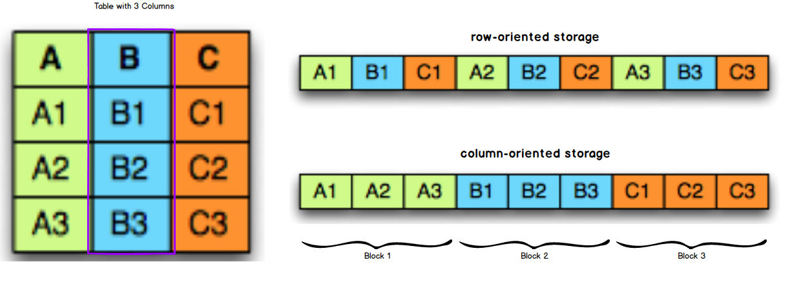
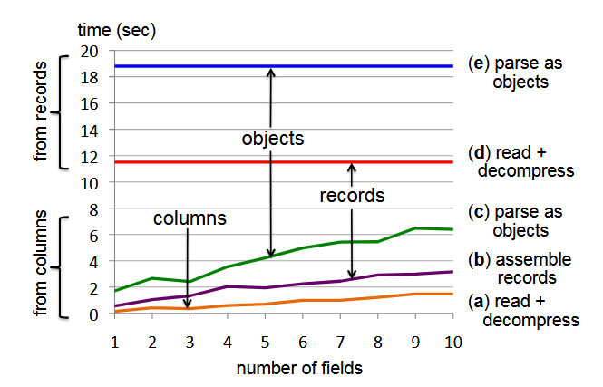
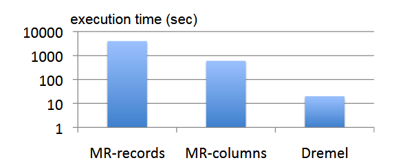
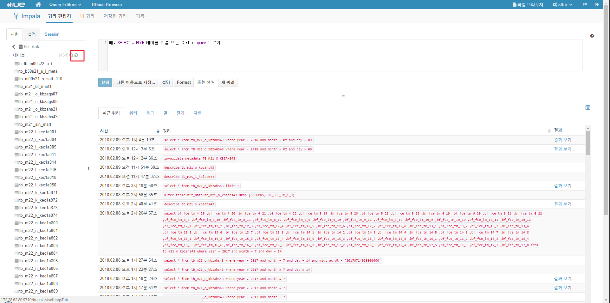

# Hadoop File(Storage) Format

## 목차
1. Hadoop File Format이란
1. File Format이 중요한 이유
1. File Format의 종류

## Hadoop File Format이란
HDFS(Hadoop's Distributed File System)에 저장하는 데이터의 형태를 의미한다. 

## File Format이 중요한 이유
분산 파일 시스템에서 가장 중요한 것은 특정한 위치에 저장된 데이터를 읽거나, 특정 위치로 데이터를 쓰는데 소요되는 시간을 최소화 하는 것인데, Use Case 별로 적절한 File Format을 사용하는 것이 이러한 성능을 향상하는데 도움을 줄 수 있다.

1. Faster Read Time
1. Faster Write Time
1. Splittable files(dataset을 분리하여 부분만 읽어올 수 있음)
1. Schema evolution support(데이터 셋의 field를 자유롭게 변경 가능)
    - [Schema Evolution](https://docs.oracle.com/database/nosql-11.2.2.0/GettingStartedGuide/schemaevolution.html)
1. Advanced Compression Support

## File Format의 종류
- Text
- SequenceFile
- Avro (○)
- Parquet (○)
- RCFile

### Text(CSV, TSV)
- 텍스트 기반의 파일로썩 각 line의 구분은 newline character \n 로 구분한다.
- 압축을 위해서는 splitting을 지원하는 코덱을 써야 한다.(bzip2)

### Avro
- Apache Hadoop 프로젝트에서 개발된 F/W
- 이진 데이터 직렬화 라이브러리
- Avro는 Row-based format 으로 전체 데이터 조회시 사용하는게 좋다.
- Avro 데이터는 .avro 확장자를 가진다. 
- Avro는 데이터 구조를 JSON 포맷으로 정의한다. 
- PosFrame에서 IFM과 Consumer(Spout) 의 통신시 Avro 포맷을 사용한다. 
    - Kafka Queue에 있는 데이터를 Deserialization을 통해서 가져온다.
~~~
// Kafka Queue Message
{
  "tcID": "",
  "keys": [
    "TRANSACTION_CODE", 
    "WORKS_CODE", 
    "OPER_FLAG",
    ...
  ],
  "datas": {
    "201707211112710848": [ // timestamp
      "KLA12702",
      "K",
      "8",
      ...
    ] 
  }
}
~~~

- Avro 장점
    - 가볍고 빠른 data serialisation / deserialization
    - Avro는 Serialized Object로 JSON과 같이 String의 구조체에 비해 Size가 적고 파싱하는데 들어가는 시간이 적기 때문에 통신시간이 훨씬 절약
- Avro 단점
    - Avro 객체가 변경될 때 마다 보내는 쪽과 받는 쪽 모두 해당 Lib를 동시에 교체 해야 하는 문제가 있다. 즉 데이터 포멧이 바뀔 때 마다 이런 유지보수 작업이 발생하기 때문에 성능에 크게 민감하지 않는 부분은 String의 JSON을 사용하는 것을 추천한다.

### 데이터 serialization / deserialization
- 직렬화(serialization )
    - 데이터의 구조를 외부 시스템의 파일이나 메모리에서 사용할 수 있도록 byte형태로 데이터 변환하는 기술 
    - Marshalling 
- deserialization 
    - byte 데이터 로부터 데이터 객체로 변환하는 일
    - demarshalling

### PosFrame에서의 Avro 사용

~~~
byte[] message = fetchMessage.getMessage();
String strTopicName = fetchMessage.getTopic();
this.partition = fetchMessage.getPartition();
this.offset = fetchMessage.getOffset();
SFMessage sfMessage = null;
try 
{
    sfMessage = AvroHelper.unmarshalAvroWithCompression(message, SFMessage.getClassSchema());
} 
catch (Exception e) 
{
    PosDataFormatHelper.printLog(e.getMessage(), e, ERROR);
    return;
}
~~~

### Parquet
parquet는 트위터에서 개발한 하둡에서 사용하는 open-source Column File Format 이다.

### Column File Format ?
일반적인 데이터베이스 테이블은 행기반 스토리지의 형테인데, 스토리지의 디스크 블록은 행에 포함된 모든 열의 데이터를 저장한다. 
그와 달리 열기반 스토리지는 각 열 값이 디스크 블록에 순차적으로 저장되는 방식 
(※ 디스크 블록 ? 연속된 디스크 영역으로 I/O가 발생하는 단위)

### Parquet의  장점
1. 레코드에서 일부 컬럼만을 조회할때 디스크 I/O 에서 큰 이점을 갖는다.
    - 위 그림에서 B Column을 조회한다고 가정했을 경우, 
        - row-oriented storage는 Block 1 ~ 3 까지 모두 I/O 발생(총 3회)
        - column-oriented storage는 Block 2 에 대해서만 I/O 발생(총 1회)
    - 기존 로우 단위 저장방식은 한개의 컬럼을 보거나 전체 컬럼을 보거나 동일한 디스크 I/O가 발생
2. 컬럼별로 데이터가 비슷하기 때문에 컬럼단위 압축시 훨씬 향산된 압축 성능을 보여준다. 
3. 압축률이 높으면, 데이터 조회시 발생하는 네트워크 대역폭의 사용량이 줄어든다. 

### Dremel 논문
Cloudera 의 Impala의 기반이 되는 Query System에 관한 논문

&nbsp;&nbsp;&nbsp;&nbsp;&nbsp;&nbsp;&nbsp;&nbsp;&nbsp;&nbsp;&nbsp;&nbsp;&nbsp;&nbsp;&nbsp;Performance comparison between column-oriented and record-oriented

Dremel 논문에서 측정한 컬럼파일포맷과 레코드파일포맷의 성능측정 결과를 비교해 보면 성능이 확연하게 차이가 남을 알 수 있다. 컬럼파일 포맷은 컬럼의 갯수가 적어질수록 성능이 더욱 좋아지는 반면에 레코드파일포맷은 컬럼갯수와 상관없이 항상 동일하게 나쁜 수행시간을 갖는다.

위 이미지는 3000개의 노드들 및 85 억개 레코드에 대해서 측정한 쿼리 실행시간을 나타낸다. 보면, 동일한 MapReduce 작업을 하는데 있어서도 컬럼파일 포맷이 훨씬 더 월등한 성능을 보여줌을 알 수 있다. 

### PosFrame에서의 Parquet
- PosFrame에서 사용하는 모든 하둡데이터는 parquet File Format으로 저장된다. 
- parquet File Format으로 데이터를 저장하기 위해서는 parquet 테이블을 생성하면 되고, 생성작업은 Impala 혹은 Hive를 통해서 할 수 있다.
(초기버전의 Impala에서는 테이블 생성 기능을 제공하지 않았으므로, Hive Client를 사용한 테이블이 선행되는 프로세스가 만들어 진것으로 보임)
- parquet 테이블 생성을 위해서는 CREATE Table 구문에 더하여 STORED AS PARQUET Syntax를 추가하여 테이블 생성 쿼리를 실행하면 된다.
- PosFrame에서는 hive를 통해 parquet 테이블 생성한다. 
~~~
hive> CREATE TABLE parquet_table_name (x INT, y STRING)
  STORED AS PARQUET;
~~~

- Hive를 통해 테이블을 생성하면 데이터 SELECT 및 INSERT를 HIVE나 IMPALA를 통해 실행할 수 있는데, IMPALA를 통해 새롭게 추가된 HIVE 테이블의 최초 접근시에 IMPALA가 새롭게 추가된 테이블을 인식할 수 있도록 해주어야 한다. 
- 테이블 인식을 위해서는 metastore 데이터베이스에서 관리되는 메타데이터를 reload 하여 테이블 정보를 업데이트 해야 하는데, 이를 위한 방법은 다음의 두가지가 있으나 REFRESH가 더욱 성능이 좋기 때문에 REFRESH 사용한다.
~~~
impala> INVALIDATE METADATA [[db_name.]table_name]
impala> REFRESH [db_name.]table_name
~~~

- REFRESH는 impala-shell을 통해서도 가능하지만, PosFrame 개발시에는 Hue를 통해서 할 수 있다.

- REFRESH가 성능이 좋은 이유는 INVALIDATE METADATA는 전체 테이블에 관한 메타데이터를 RELOAD BUT, REFRESH는 NEWERLY ADDED 테이블의 메타데이터만 LOAD 하기 때문이다.

## PosFrame HDFS에서 Parquet를 써야만 하는 이유
- Disk 사용량이 Avro가 두 배가량 더 많다
- Query processing time이 Avro 보다 Parquet가 월등하다. 

## 참고자료
- [A Beginner's Guide to Hadoop Storage Formats](https://blog.matthewrathbone.com/2016/09/01/a-beginners-guide-to-hadoop-storage-formats.html)
- [How Impala Works with Hadoop File Formats](https://www.cloudera.com/documentation/enterprise/5-7-x/topics/impala_file_formats.html)
- [How to Choose a Data Format](https://www.svds.com/how-to-choose-a-data-format/)
- [Hadoop I/O: Sequence, Map, Set, Array, BloomMap Files](http://blog.cloudera.com/blog/2011/01/hadoop-io-sequence-map-set-array-bloommap-files/)
- [Performance comparison of different file formats and storage engines in the Apache Hadoop ecosystem](http://blog.cloudera.com/blog/2017/02/performance-comparing-of-different-file-formats-and-storage-engines-in-hadoop-file-system/)
- [자바 직렬화, 그것이 알고싶다. 훑어보기편](http://woowabros.github.io/experience/2017/10/17/java-serialize.html)
- [Dremel made simple with Parquet](https://blog.twitter.com/engineering/en_us/a/2013/dremel-made-simple-with-parquet.html)