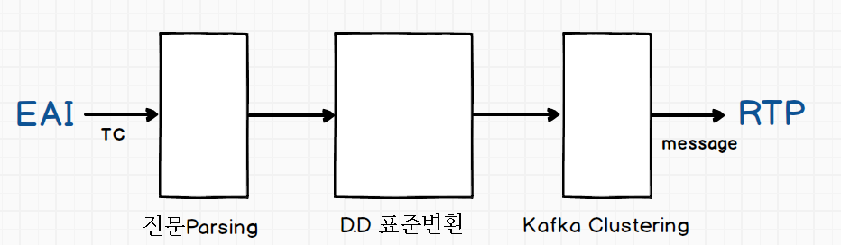

# IFM( Interface Middleware)

## TBD
- Topic이 포함하는 TC정보는 어디서 알 수 있는가 ?

## IFM Process Diagram

## Interface 등록 Format 이행 경로

IRMS -> DPBAS -> TPBAS -> TPHMN,TPHMNR -> PPBAS -> PPHMN(NRTP), PPHMNR(RTP)

## 전문Parsing

### IFM에서의 Tag 항목 식별 및 C등급 수집 제외
Data Dictionary에 snum(std_item_snum의 약어) 항목의 Value가 정의되면, snum이 부여된 항목이 A,B등급 항목으로 IFM에 의한 수집대상으로 포함되며
IFM에서 DD정보를 동기화하여 관리하는 테이블을 통해, 수집대상 여부를 체크한다. 

Format의 등록은 기존 MES 시스템에서 하던 방식과 동일한데, 이전에 언급하였듯이 차이점은 STD_ITEM_SNUM(표준항목일련번호)를 각 Tag별로 Mapping해주어야 한다. 아래 테이블 및 컬럼을 참조하여 값을 수작업으로 맵핑해야 해주어야 한다.

(※ 기타 다른 자동화된 방법이 있는지 확인필요)
  - Table: TB_S02_STANDARD_IF
  - Column: std_item_snum
  - schema: possfma
    
위와 같이 Snum이 맵핑되어 IRMS에 포맷이 등록되게 되면, IFM에서 해당 TC 수신 시 C 등급 항목을 판별해 A,B 등급만 Filtering해 수집이 가능해진다. 

### C등급 Tag 항목의 식별 및 Filtering을 IFM 에서 하는 이유
Tag의 등급이 A,B 등급인 항목들만 TC Layout으로 등록하면 되는데, C등급 항목을 모두 포함해서 IFM 수신 후 Filtering을 하게 된 이유는 무엇일까 ? 그것은 A,B등급으로 정의되는 항목들은 고정이 아니라 가변이기 때문이다.
A,B등급만 Layout을 정의하고 나중에 A,B등급 항목이 변경되면, TC수정에 대한 비용이 발생한다. Layout변경에 따른 유지보수 비용을 없애고자, 한번에 A,B,C등급을 전체 다 받은 후 IFM에서 Parsing 에서 Tag 식별 후 C등급 항목을 버리게끔 로직이 개발된 것이다.

### Tag 식별은 왜 데이터서비스의 업무 영역이 되었을까 ?
Smart Factory의 데이터 서비스 영역의 주된 역할은 Micro 데이터의 수집 및 저장관리인데, 
이미 IT기술서비스 영역에서 데이터 수집/저장에 대한 Backbone 기능이 완결된 상태에서 데이터 서비스 영역의 역할은 무엇인가에 대한 고민이 생겼다. 

Backbone으로써 IFM 및 IT기술서비스는 Biz에 대한 Code를 포함하려 하지 않았는데, 
어떤 Tag가 저장대상인지 아닌지에 대한 판단은 결국 Biz의 개념으로 보았으며 데이터 서비스부문의 업무영역으로 포함되었다. 

## D.D 표준변환

### Tag항목 등급별 D.D 등록 상태

 - A 등급: 표준항목 상세에서 기본속성이 정의되어 있으며 표준항목 ID 부여, snum 부여 → Hadoop에 표준항목ID로 저장
 - B 등급: PC/PLC항목 속성만 존재, sunm 부여 → Hadoop에 PC/PLC 항목 ID로 저장
 - C 등급: DD에 정의되지 않으며, snum 없음 → Hadoop에 관리 안함
          (단, TC 원본은 Hadoop에 보관함)
 - DD 시스템에서 표준테이블 등록된 항목들은 snum이 0 or 1로 시작하지만, 표준변환테이블에 등록이 되지 않고 자체 판단에 의해서 항목 수집이 필요한 경우에는 snum을 임의로 부여해서 항목을 hadoop에 저장하고 있다. 

### Scale 실적 국제표준단위 변환 기능

TC NET에서 발생하는 데이터들은 모두 Range 값을 가지고 생성되는데, 각 장치별로 각기 다른 Scale단위를 사용하기 때문에 단위를 표준화 한 후 데이터 저장이 필요하다.

다음 이미지는 meter/min가 국제표준단위라고 가정할때 다른 scale의 값을 저장하는 과정을 설명하는 그림이다. 

IFM은 국제표준단위가 존재하는 것에 대해서만 단위 변환을 해주지만, 일부에 대해서는 국제표준단위가 아님에도 Scale 변환 기능을 지원한다. 
<u>프로젝트 PM은 장치별 Tag항목의 속성을 파악하여 항목표준화시 국제표준단위로 변환되어 저장할 수 있도록 요구를 해야 한다.</u>

### range 변환 테이블
possfma.tb_s02_range_if
UOM -> 단순단위
SCL -> md_rule_oper_type 에 계산식이 들어가서 방정식으로 계산되는 것들

Tag의 값이 Min Max를 벗어나는 경우에는 해당 Tag의 Min Max 설정치 값으로 변경하여 계산식에 입력값으로 적용후 결과값을 계산한다. 

## Kafka Cluster

### Kafka 소개
kafka는 분산 스트리밍 플랫폼으로서 topic 단위로 message(record)를 식별하고 Producer 로부터 수신한 message를 Broker에서 Queuing 한 후 Consumer가 message를 소비하는 데이터 흐름(stream)을 따른다. 클러스터에 따른 각 broker 별로의 분산처리는 Apache Zookeeper가 담당한다. 

### Kafka Cluster에서 사용하는 용어
- Topic: Producer에게서 전달받은 message(TC데이터)를 식별하는 ID. PosFrame에서 각 topic은 각 Device에서 수집하는 TC와 1:N의 관계를 가진다. 
- Producer: Kafka 에서 제공하는 API이며, 이 API를 사용하여 message를 Kafka 의 특정 topic으로 전달 한다. PosFrame 기준으로 이해하면, IFM에 수신된 TC가 D.D표준변환을 완료하면, Producer의 Thread가 TC message 수신을 listener에서 이벤트 수신하여 Broker로 topic에 맵핑된 message를 전달한다. 
- Broker: Kafka Cluster에 구성된 각각의 Host(machine) 이며, 각각이 하나의 Queue 이다.
- Partition: 하나의 Topic을 Broker에 분산하여 저장할 수 있다.(topic을 복제개념이 아닌, 동일한 topic의 다른 message를 서로다른 Broker에 저장하는 것을 의미)
- Consumer: PosFrame 기준으로 spout가 consumer의 역할을 수행한다. 
- replica: topic의 복제본

## PosFrame Kafka Cluster 구성(광양 후판 기준)
PosFrame에서 각 수집장치(Device)로부터 TC를 수신하여 Kafka cluster에서 데이터 스트림을 처리하여 RTP의 시작(Spout, Consumer) 로 데이터를 저장하는 프로세스는 다음과 같다. 

PosFrame 확산시 각 공장별로 Kafka Cluster를 구성하며, 공장단위로 세개의 Broker를 현재 운영하고 있다. 후판공장의 Broker URL은 위 그림에 표시되었으며 세부정보는 IT기술서비스사업부의 인프라 설치 및 개발환경 Guide에 자세히 설명되어 있다. 

인프라에서 I/F Middleware 모니터링을 위해서 [IOT Manager](http://172.28.62.160:8080/IotManager/index.html) 라는 포털을 제공하고 있으며 로그인 후 Monitoring 공장을 선택하면 상세정보가 확인이 가능하다. 

### Topic 별 Message 정보 확인
Monitor > Kafka Monitor 에 접속을 하면 각 Topic 별 partition 정보를 확인이 가능하고, Messaga의 offset 정보 및 Message의 상세 데이터를 확인할 수 있다. 

Message를 더블클릭하면 상세정보를 확인할 수 있는데, Message는 결국 수신받은 TC 1개의 전체 정보를 담고 있으며 그 구조는 다음과 같다.
~~~
Message:
{
  "tcID": "",
  "keys": [
    "TRANSACTION_CODE", 
    "WORKS_CODE", 
    "OPER_FLAG",
    ...
  ],
  "datas": {
    "201707211112710848": [ // timestamp
      "KLA12702",
      "K",
      "8",
      ...
    ] 
  }
}
~~~

### TC Layout정보 확인
Layout > Layout 에 접속하면 해당 공장 IFM에서 수신하는 TC 정보를 확인할 수 있으며
TC ID, Format ID가 연결된 정보를 확인할 수 있다. 

### 수집장치, Topic, TC 의 연계정보 확인
Metrics > MongoDB Log 에 접속하면 수집장치, Topic, TC 의 연계정보를 확인할 수 있다.

### 신규 TC 추가시 IFM 구성을 위해서 해야 할 일
- 신규 TC를 IFM에 수신시 해당 TC를 신규 Topic을 신설할 지, 기존 Topic에 추가할지에 대한 의사결정이 필요할 것으로 보이고, 이인 부장에게 요청
- RTP Stage까지 확장해서 생각하면, 
  - 만약 신규 Topic이 생성되면, Storm의 Spout, Bolt 를 연결하는 <u> Topology 재구성 필요</u>
  - 기존 Topic을 사용하면, <u>Topology 구성이 필요 없음</u>

### Kafka in PosFrame 

#### Kafka Topic Naming 표준
총 21자릿수에 대해서 Naming 수행
Topic Naiming 시에 Interface ID도 사용되는데, Topic과 TC는 1:N의 관계이므로 여러개의 TC에 서로다른 I/F를 사용하는 경우 I/F 가 제일 많은 것을 추출하여 Topic Naiming에 사용한다. 

## I/F Middleware 업무 담당
이인 Senior Manager

## 목록
- [목차](./0.목차.md)

