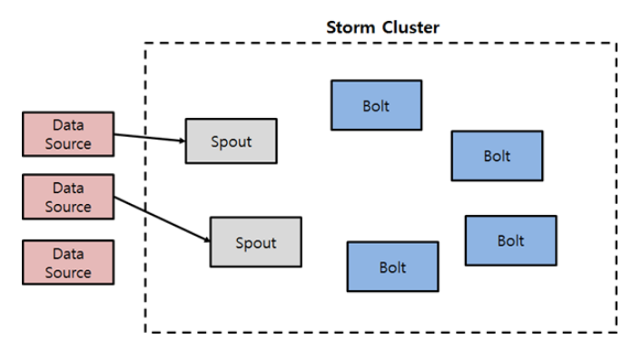
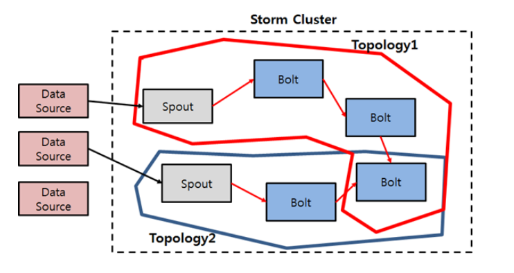
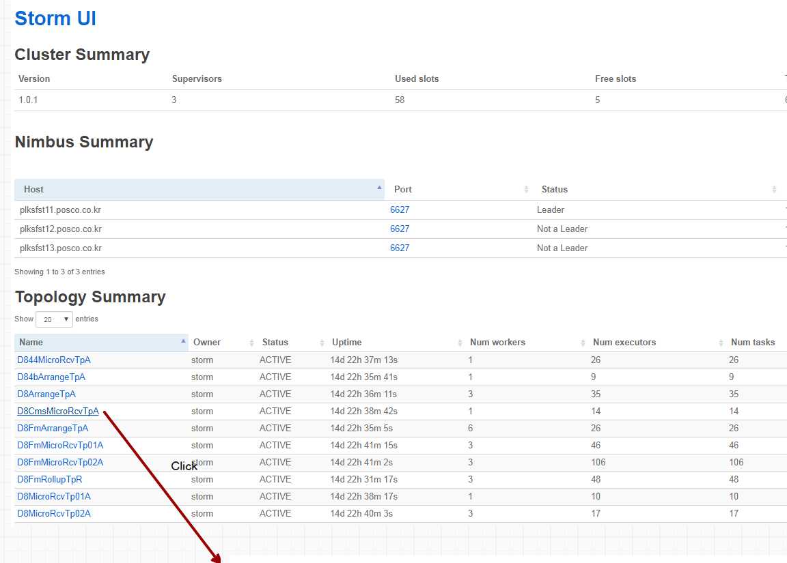
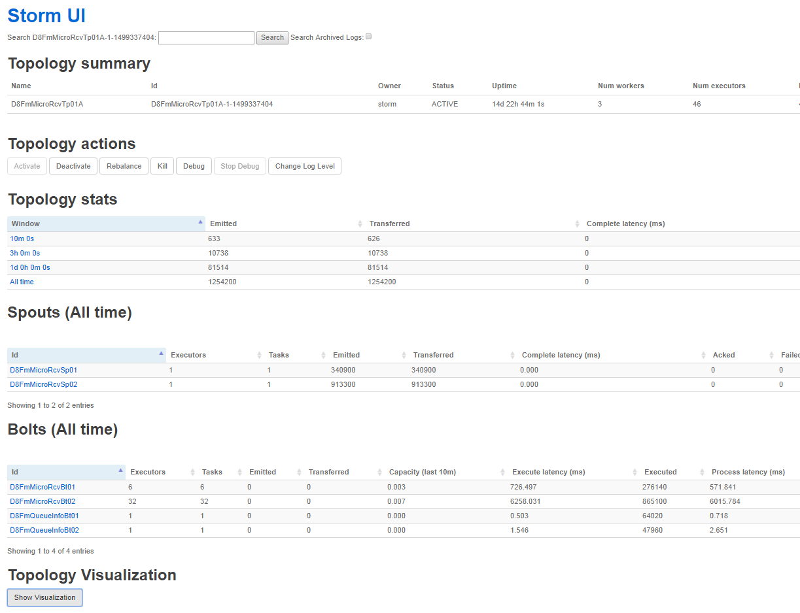
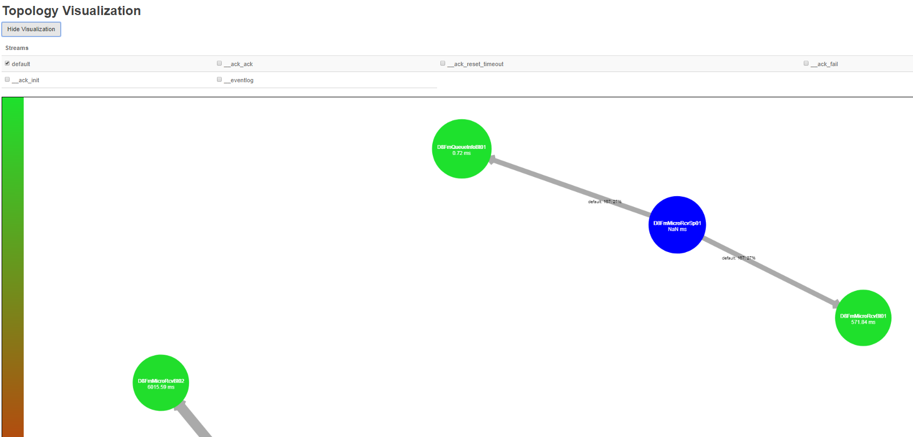
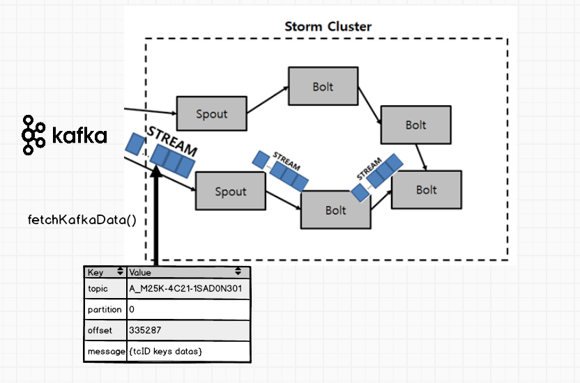
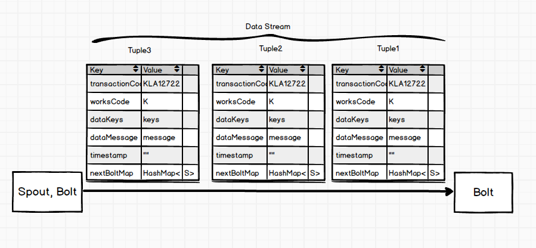
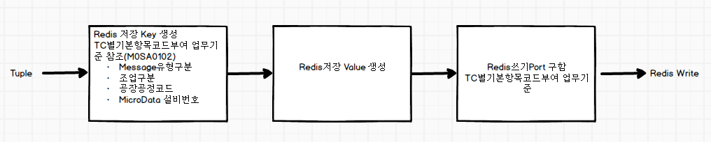
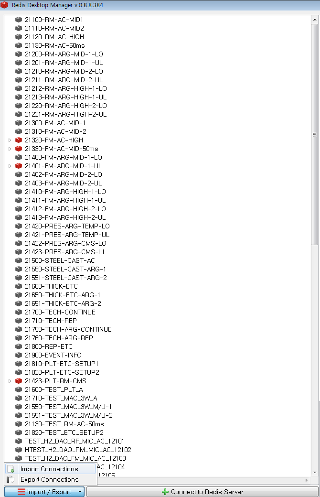

# RTP(Real-Time Processing)
RTP는 IFM의 Kafka Broker(Host)에 Queuing 된 message를 storm Topology 내의 spout 에서 Topic을 통해 message를 읽어와 bolt로 tuple 데이터를 전송하여 bolt내에 정의된 biz 로직 처리한다. 그 후 In-memory DB인 redis 의 각 port 별로 데이터를 저장하는 과정을 거친다.

지금부터 RTP 각 단계별 상세한 기능 및 프로세스에 대해서 설명하고자 한다.

## Storm Cluster
Storm은 실시간 streaming 처리를 위한 프레임웍이다. Storm을 이해하기 위해 필수적으로 먼저 이해해야 하는 것이 Spout, Bolt의 개념이다.

### Spout
Spout은 Storm Cluster로 데이터를 읽어들이는 데이터 소스(Consumer)이다. 이렇게 읽어들인 데이터는 Topology에 정의된 다른 Bolt로 데이터를 전달한다. 
~~~
 /*
  이 메서드는 Spout이 처음 초기화 될때 한번만 호출되는 메서드로, 데이타 소스로 부터의 연결을 초기화 하는 등의 역할을 한다. 
  */
 open() 

 /*
  이 메서드는 데이타 스트림 하나를 읽고 나서, 다음 데이타 스트림을 읽을 때 호출 되는 메서드 이다.
 */
 nextTuple() 

 /*
  이 메서드는 데이타 스트림이 성공적으로 처리되었을때 호출되는데, 이 메서드에서는 성공 처리된 메세지를 지우는 등, 성공 처리에 대한 후처리를 구현한다.
 */
 ack(Object msgId)

 /*
  이 메서드는 해당 데이타 스트림이 Storm 토폴로지를 수행하던중에,에러가 나거나 타임아웃등이 걸렸을때 호출되는데,이때에는 사용자가 에러에 대한 에처 처리 로직을 명시해야 한다. 흔히 재처리 로직을 구현하거나 또는 에러 로깅등의 처리를 하게 된다.
 */
 fail(Object msgId)
~~~

### Bolt
Bolt는 Spout로부터 읽어들인 데이터를 처리하는 함수이다. 수신한 데이터를 내부 비즈니스 로직에 따라서 가공한 다음 다음 Bolt로 넘겨주거나 종료한다. 

주요한 메소드는 다음과 같다.
~~~
/*
 이 메서드는 Bolt 객체가 생성될때 한번 호출 된다. 각종 설정 정보나 컨텍스트등 초기 설정에 필요한 부분을 세팅
*/
prepare (Map stormConf, TopologyContext context, OutputCollector collector) 

/*
 가장 필수적인 메서드로, Bolt에 들어온 메세지를 처리하는 로직을 갖는다. 종단 Bolt가 아닌 경우에는 다음 Bolt로 메세지를 전달한다
*/
execute(Tuple input)
~~~

#### PosFrame Bolt
Queue Info Bolt - kafka_010 table을 참조하여 Redis 에 저장된 TC의 정보 관리 ?

무부하 정렬 Bolt - 부하정렬시 무부하 데이터까지 동시에 정렬을 진행하면 데이터가 많아서 성능 저하의 문제가 생기므로 무부하 데이터에 대해서 미리 정렬을 수행하는 Bolt 이다. 
최대작업시간 및 무부하판단시간 값을 기준으로 관리하여 최대작업시간에서 벗어난 과거 데이터에 대해서 무부하판단시간 만큼의 데이터에 대해서 잘게잘게 정렬을 수행한다. 

Storm 클러스터 내의 여러개의 Spout과 Bolt가 존재하고 다음과 같이 구성된다.

### Topology
Spout과 Bolt간의 연관 관계를 정의해서 데이터 흐름을 정의하는 것을 의미한다.
Topology 단위로 worker memory 수를 정의 하는데, worker가 의미하는 것은 Strom서버의 물리적 갯수이다. 또한 Topology 별로 memory가 정의되면 bolt에서 사용하는 thread별로 사용할 수 있는 memory용량의 총량이 정해지고, 각 thread별 memory 용량도 알 수 있다. 
무조건 thread 갯수만 늘린다고 되는것이 안되는게 thread별 memory에 제약이 생기므로, 무조건 thread갯수를 늘린다고 무조건 성능이 늘지 않는다. 

Kafka Topic Mesage가 여러 Topology에서 사용이 되어져야 하는 경우, 이 Topic이 어느 Topology에서 사용되어졌는지를 어떻게 구분할 수 있는지 ?

TB_TOPOLOGY_FLOW 에 TOPOLOGY의 META 정보가 담기는데, PARAMETER 항목에 셋팅된 TOPIC NAME을 확인하여 동일한 TOPIC을 바라보는 TOPOLOGY가 있는지를 알 수 있고, CONSUMER GROUP정보를 통해 진행상황을 확인할 수 있다. 

KAFKA TOPIC MESSAGE의 삭제는 24시간이 지나면 자동으로 삭제되고, TOPOLOGY에서 사용한 것과 관련없이 MESSAGE는 계속 유효시간 동안은 계속 남아 있게 된다. 

### Topology Meta SetUp

#### 수행 담당
Topology의 Meta 정보 구성은 최초 R&D에서 수행 하였으나, 현재는 플랫폼 섹션에서 수행

#### Naming
 - Topology ID Naming 기준은 [광)후판 Smart Factory 플랫폼 데이터 활용 개선어플리케이션 설계서(11. 수집/정렬 모듈 관리)](http://swpecm.posco.net:7091/ECM/swp_interface.jsp?ACTID=viewlink&OBJECTID=30393030626634623963333731373337&DOCID=646f6330393030626634623962343231363362&SYSID=45434d) 참조 한다.

#### SetUp 절차
 - 메타데이터 셋업을 위해서는 <b>[PsqlODBC.msi](./assets/install/PsqlODBC.msi)</b>파일 설치한다.
 - <b>[광양_후판 DB변경_메타데이터 셋업(PPAS용-개발계용).xlsm](http://swpecm.posco.net:7091/ECM/swp_interface.jsp?ACTID=viewlink&OBJECTID=30393030626634623962373361356237&DOCID=646f6330393030626634623962373361356237&SYSID=45434d)</b> 문서에서 셋업

#### SetUp 결과 저장 테이블
???

#### 동일한 Spout & Bolt로 설계된 Topology가 서로 다른 Naming을 가지는 이유는 ?
Topology별로 JVM을 할당할 수 있으며, Worker 수 라던지 resource의 할당을 Topology 별로 할 수 있기 때문에 동일한 Topology여도 분리를 시켜서 관리한다.

### Topology별 Spout & Bolt 연계관계 확인
 - <b>[전문별Topology및Topic매핑(참고용).xlsm](http://swpecm.posco.net:7091/ECM/swp_interface.jsp?ACTID=viewlink&OBJECTID=30393030626634623962653164353265&DOCID=646f6330393030626634623962353863643461&SYSID=45434d)</b> 엑셀 매크로 문서 참조. 
    - Topology 설계 담당: 박순종 과장
    
 - 김남일 PCP 작성 "Biz플랫폼 업무기준 Set_Up 원장" 엑셀 파일의 "Spout&Bolt" Sheet참조
 - Storm UI 에서 제공
    - [Storm UI](http://172.28.62.186:8000/index.html) 에 접속하여 Topology Name Click
    - Supervisors: Storm 서버 대수
    - Nimbus: 
    - Topology actions
        - Deactivate: stop spout, running bolt
        - Rebalance: 해당 topology의 재배치시 사용
        - kill: kill topology
    
    

    - Topology Summary를 통해 spout, bolt에 관한 정보 확인 

    

    - Topology Visuallization을 통해 spout, bolt간의 데이터 흐름을 볼 수 있다.

    

## PosFrame Topology 종류
Micro Topology - 정렬 전 Redis Port로 저장하는 역할 

Macto Topology - 주로 P/C에서 올라오는 Macro 성 데이터를 처리하는 역할을 수행한다. 
Micro Data들의 정렬을 수행하기 위한 Trigger 정보들을 보통 작업완료 Event 테이블에 저장을 해두고, 정렬 Bolt를 기동하여 정렬전 Redis Port에 있는 데이터를 읽어들여 정렬을 수행하고 정렬 후 Redis Port에 저장을 한다. 동시에 정렬전 Port의 데이터를 삭제하고 PPAS 에 정렬에 대한 결과 정보를 Update를 한다. 
그리고 정렬 후 Bolt에서 Flume에 Event 를 던져 Flume에서 정렬 완료 된 데이터를 읽어갈 수 있도록 정보를 전송한다. 

### Stream & Tuple
Kafka Queue로부터 Topic(TC) message를 Storm Cluster에서 처리되어 Redis에 저장되는 형태를 이해하기 위해서는 Stream과 Tuple 에 대한 개념을 이해해야 한다. 

#### Stream
Spout와 Bolt간 혹은 Bolt 사이에 전송되는 "데이터들의 집합"을 이야기 한다. Kafka Queue의 Topic데이터를 Stream 형태로 읽어들인다. 

PosFrame에서 Kafka Queue로부터 Stream 을 fetch 메소드를 사용하여 가져온다.

#### Tuple
각각의 Stream은 하나의 Tuple로 이루어 지는데, Tuple은 Key, Value 형태로 정의된다. 

PosFrame에서의 Tuple의 모양은 다음의 그림의 형태를 갖는다.

## Redis 저장

### 프로세스
Bolt에 의해서 Tuple 데이터가 Redis에 저장되는데, 
각 수집 Tag별로 Key-Value 값을 만들어 Redis에 데이터를 쓰게 된다.

다음 그림을 통해 좀 더 세부적으로 단계를 살펴보면,

 - 1차 Key 생성 
 - Value 생성 
 - Redis Port 얻기

Key-Value의 체계는 Message Type별로 구분되며,
Key, Value를 구성하는 항목의 구성품들은 [Smart Factory 데이터영역 항목 및 Table설계](http://swpecm.posco.net:7091/ECM/swp_interface.jsp?ACTID=viewlink&OBJECTID=30393030626634623963323931643330&DOCID=646f6330393030626634623962343730643939&SYSID=45434d) 파일의 "2.Redis 항목설계" Sheet 를 참조한다.

TC별 사용하는 Redis Port는, 
TC별기본항목코드부여 업무기준 사용하며 데이터 관리 파일 원장은 [Biz 플랫폼 업무기준 Set-up](http://swpecm.posco.net:7091/ECM/swp_interface.jsp?ACTID=viewlink&OBJECTID=30393030626634623963313537323038&DOCID=646f6330393030626634623962356135653331&SYSID=45434d) 에 "2.TC별기본항목코드부여" Sheet를 참조한다. 
- com.posco.sf.m00s21.p020.common.tempRule.k.m25.R_B0002_RULE_DATA

그런데 파일에서 보면 Redis 쓰기 Port랑, 정렬 Read Port가 서로 다른데 왜 그럴까 ?
정렬 대상의 데이터는 Redis의 정렬전 데이터를 읽게되는데, 동일한 TC에 대해서 정렬 Read Port는 왜 Redis쓰기 Port랑 서로 다른가 ? 
(※ KLA12722 - Redis쓰기 Port: 21100, 부하정렬Redis읽기Port: 22200)

Redis Write Port는 Master Port에 값을 쓰며, Slave Port에서 Master의 데이터를 공유한다. 
정렬 Read Port는 Slave Port이며, Master Port로부터 복제된 값을 가지고 있으므로 Port번호는 다르지만 정렬전의 데이터를 읽어올 수 있으므로
문제될 것이 없다. 
(※ TBD: Redis Master/Slave Port 관계도는 어디서/어떻게 확인할 수 있는가?)

## Message Type 별 Redis 데이터 저장 프로세스
정렬대상, 정렬미대상 영역은 Redis의 Port번호로 구분이 된다. 

### 정렬대상
 - 정렬 수행 전: Tag별 Value뿐만 아니라 Value에 대한 Meta정보가 추가됨으로 Resource가 증가
 - 작업완료 event: 정렬전의 데이터를 추출해서 정렬 수행 후 정렬 후 Port에 데이터 Write
 - 정렬 수행 후: 정렬 후 Port로 바로 저장되서 Flume을 통해 Hadoop 저장

### 정렬미대상

    
### TC원본데이터
원본데이터는 Redis 거치지 않고 Flume을 통해 Hadoop 에 바로 저장 된다. 
이 원본데이터이 왜 필요했는가 ? 
 - 최초 PosFrame 구축시 데이터가 데이터 서비스 부의 로직을 통해 제대로 저장되는지 비교 확인할때 필요
 - 데이터 유실시를 대비하기 위한 백업기능을 위해 
    - 원본데이터는 최초에 조회할 수 있는 화면이 존재하지 않았는데 활용개선 Project를 진행하면서 원본데이터 조회 화면 생성
    - 원본데이터는 File Format으로 저장
    - 원본데이터는 3개월 저장
    - 가공이 없으므로 A,B,C 등급 항목 모두 저장
    - Hue에서 보면 partition 이 raw_data / M23 / 3W / tc 코드 / 년/ 월 / 원본파일.raw -> 팟캐이가 아님
    - 원본데이터를 Backup을 통해 정렬 모듈을 실행하는 기능은 현재 없음

TC로 받은 데이터는 deliminator를 붙여서 String을 만들어 준다. 
 . 2시간
 . Hue에서 조회를 하면 data 디렉토리가 정렬 후 데이터가 저장되는 partition 이다. 
 . data/ m25 / 8 -> column 형태로 저장된 데이터
 . data / m25 / Tb_m25_s -> row 형태로 저장된 데이터

Redis 저장시 Value는 Type별로 구분하며 저장된다. 
 - String 인 경우 Key-Value Mapping 된 값 저장
 - Sorted Set 인 경우 Redis에 Micro 데이터 저장시 score 값을 생성하여 Key, Value 와 같이 저장

> Redis 관련 소스는 com.posco.sf.m00s21.common.util.PosRedisUtil.java

### Redis Monitoring 환경 설치
1. [Redis Desktop Manager 설치 페이지](https://redisdesktop.com/download)
1. 설치완료 후 Redis Connection을 위한 다음의 Json 파일을 Import하여 Connection설정을 한다.
  - [redis_connection.json](./assets/config/redis_connection.json)

    연결이 완료되면 아래 이미지와 같이 Redis Port 별 리스트가 조회된다.

  - 

### Messsage 유형분류

### Default Mapping

전문에는 공통부분이 있다.(Default 영역)
- 조업구분, 공장공정코드, MicroData설비번호(플랫폼 부여)
- Asset코드
    - 지역, 설비, 조립품, 부품 으로 분류가 되어 있음
    - CMS에서 수집되는 항목에 대해서는 Asset 코드가 존재하지만, 나머지는 없음.
      그래서 Asset코드를 어떻게 셋업해야 하는지 고민이 많음
    - Asset코드는 사용자 관점에서 Asset단위로 Micro데이터를 조회하고 싶을때 filter 조건으로 활용가치가 있다. 

- IBA는 공통부분이 없으므로 IFM에서 생성
- 기술해석에서 올라오는 데이터가 정합성이 불일치 하는 경우 다수 존재(사소구분이 틀리든지) -> 데이터 서비스 부 로직에서 Dafault영역 재부여

MicroData설비번호는 왜 필요한가 ? 
- 정렬을 수행하기 위해서는 정렬을 수행하기 위한 정렬단위가 필요하다. 그 단위를 구분짓기 위해 필요한 항목
- 정렬단위를 분류화하기 위해서 꼭 맞는 항목이 존재하지 않으므로 만들어짐

# Message 유형 분류
IFM에서 D.D 표준변환이 끝난 Message 는 유형별로 구분되어 병렬로 처리되어 진다.

## Message 유형별로 분류를 했던 이유
PosFrame 구축하면서 Message 의 유형을 구분한 사유는 환경, 에너지등 Biz Domain 별, 그리고 Macro, Micro 데이터를 구분하기 위해서 였다. 하지만, 막상 데이터를 분석해 보니 Biz Domain별 데이터를 구분짓는 것은 별 의미가 없었고 Micro, Macro 측면에서 데이터를 분석하는것이 의미가 있었다.

## Message 유형 분류 기준관리 파일
Message 유형 분류 기준관리 원장 파일은 다음 제목을 포함하는 파일의 '5.In-Memory Key체계' Sheet를 참조하면 된다. 

- [Smart Factory 데이터영역 항목 및 Table설계](http://swpecm.posco.net:7091/ECM/swp_interface.jsp?ACTID=viewlink&OBJECTID=30393030626634623963323931643330&DOCID=646f6330393030626634623962343730643939&SYSID=45434d)

### 하둡저장
하둡에 파일형태로 데이터가 저장되는지를 구분하는 항목이다. 
 - O: 저장
 - X: 저장안함

### Message 유형별 특성
Message유형별로 수집되는 데이터의 특징은 다음과 같다. 
Message유형별로 상세한 특징은 다음의 파일을 참조하기 바란다.
(TBD: 자료링크)

- A: DAQ, OPC 고속주기성
- B, C: 기술해석 Micro 데이터(기술해석은 없어지는 데이터 시스템이기 때문에 기술해석 데이터 모두 수용)
- D: 조업설비 시계열 데이터
    - 재료에 Mapping되기 어려운 데이터(제강, 연주)
- I: 대표적인 Macro 데이터로 수집대상이 되는 데이터
- J: event 성(변경점), 정렬을 위해 사용되는 부가정보들을 제공한다. 
- S Type
    - 재료번호 및 길이방향 위치 부여한 데이터
    - T_M25_Z
- Z Type
    - 재료동일점 Mapping된 데이터
    - T_M25_Z

## Micro Data VS Macro Data

Micro데이터 ?
 - 시계열로 수집되며 시간정보, TagId, 값의 속성만 가지고 있는 데이터

Macro데이터 ?
 - (TBD)재료번호를 포함하며 Event에 대한 속성정보를 갖는 데이터 ????

## 전문 Queuing

현재까지 Proj 진행순서
 - 광양 후판 -> 활용개선 -> 포항 2열연 (현재) ->..... 

Hadoop은 File System 이다. 
Hadoop에 저장된 File을 SQL을 통해서 조회하고 싶은 Needs가 있어서 Impala에 구조 등록

Flume은 대량의 데이터를 처리해주는데, 유리하지만 
Tuning이 잘 되지 않으면 휴지 후 동시에 대량의 TC를 수신하는 경우 등의 케이스에 Flume이 Kill 되는 현상이 발생하기도 한다. 그렇기 때문에 Tuning이 잘 되어 Alive 상태가 유지될 수 있도록 하는 것이 중요.

Flume agent

Kafka Queue는 RTP가 Kill되도 file이 삭제 되지 않는다. 
Flume은 내부 Queue를 사용하는데 RTP 가 Kill되면 File이 삭제 그래서 현재 Kafka Queue로 변환하는 작업을 진행하지만, 데이터 size가 달라지는 현상이 발생하는 상태임

Hadoop의 partition이 최초로 잘 나누어지지 안았을 경우에는 성능이 안나와서, Partition을 최대한 늘려서 사용하게 됨

2.TC별기본항목코드부여 항목 설명
원본실적하둡저장여부 - HADOOP에 원본데이터 저장 여부로 N인 경우 REDIS에까지만 저장

PPAS에 저장하는 데이터에 관련된 기준은 9번, 3번, 2번 기준이 연관되어 있다.

10번 그룹항목사용 tc 기준
GROUP ELEMENT의 가공해서 저장하는 경우 사용하는 기준

## 목록
- [목차](./0.목차.md)