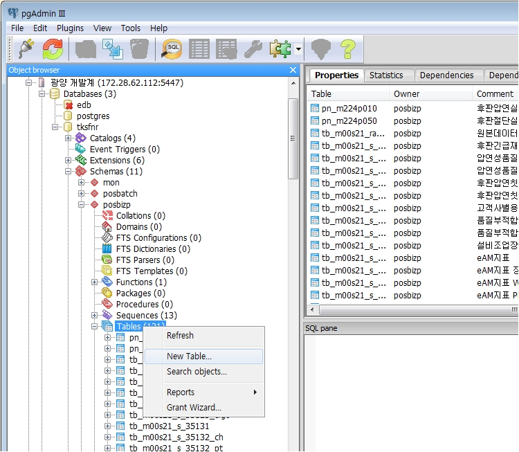

# Smart Factory 신규테이블 생성 절차

### 포항 접속정보

### 광양 접속정보

### PPAS
- 개발계
    - 주소 : 172.28.62.112:5447/tksfnr
    - 아이디 / 비밀번호 : posbizp / orange
   
- 운영계
    - 주소 : 172.28.62.111:5447/pksfnr
    - 아이디 / 비밀번호 : posbizp / orange
   
#### IMPALA ( 하둡 ) 
- 개발계
    - 주소 : http://172.28.62.80:9710/impala/#query
    - 아이디 / 비밀번호 : sfbiz / sfbiz
   
- 운영계
    - 주소 : http://172.28.62.50:8888/impala/#query
    - 아이디 / 비밀번호 : sfbiz / Posco1ct
   
#### Tool 다운로드
- pgAdmin 3 (window)
- 주소 : https://www.pgadmin.org/download/pgadmin-3-windows/
 
#### PPAS DDL 실행방법
- pgAdmin의 New Table 을 사용

#### PPAS DDL 쿼리
pgadmin 에서 조회한 Table 중 아무거나 선택하면 SQL Pane에 DDL 쿼리가 조회되는데, 그 쿼리를 참고로 DDL 쿼리를 작성한다.

Insert 쿼리 Format
~~~
CREATE TABLE table_id
(
    attribute_id attribute_type size (Nullable), --Comment
    ....
    CONSTRAINT pkpn_m00s21_video_002_std_pk PRIMARY KEY (transaction_code, operation_seq_num, standard_english_id)
)
WITH (
  OIDS=FALSE // OIDS: postgressql은 테이블 생성 시 기본키를 설정하지 않으면 내부적으로 키를 생성하는것을 말한다.
             // OIDS = FALSE 내부적으로 키를 생성하지 않는다는 의미
);
ALTER TABLE table_id
  OWNER TO posbizp;
GRANT ALL ON TABLE table_id TO posbizp;
GRANT SELECT, UPDATE, INSERT, DELETE ON TABLE table_id TO posrwbizp;
GRANT SELECT, UPDATE, INSERT, DELETE ON TABLE table_id TO posmgbizp;
GRANT SELECT ON TABLE table_id TO poswork;
GRANT SELECT ON TABLE table_id TO posrwwork;
GRANT SELECT ON TABLE table_id TO posmgwork;
GRANT SELECT, UPDATE, INSERT, DELETE ON TABLE table_id TO posmgsfma;
GRANT SELECT, UPDATE, INSERT, DELETE ON TABLE table_id TO possfma;
COMMENT ON TABLE table_id
  IS 'table_name';
COMMENT ON COLUMN table_id.attribute_id IS 'attribute_name';
...
~~~

Insert 쿼리 예제
~~~
-- Table: tb_m00s21_video_002_std
-- DROP TABLE tb_m00s21_video_002_std;
CREATE TABLE tb_m00s21_video_002_std
(
  transaction_code character varying(8) NOT NULL, -- TransactionCode
  operation_seq_num numeric(22,0) NOT NULL, -- OperationSequence번호
  standard_english_id character varying(50) NOT NULL, -- 표준항목ID
  created_object_type character varying(1) NOT NULL, -- 생성Object유형
  created_object_id character varying(22) NOT NULL, -- 생성ObjectID
  created_program_id character varying(22) NOT NULL, -- 생성프로그램ID
  created_timestamp timestamp(6) without time zone NOT NULL, -- 생성일시
  last_updated_object_type character varying(1) NOT NULL, -- 최종변경Object유형
  last_updated_object_id character varying(22) NOT NULL, -- 최종변경ObjectID
  last_updated_program_id character varying(22) NOT NULL, -- 최종변경프로그램ID
  last_updated_timestamp timestamp(6) without time zone NOT NULL, -- 최종변경일자
  data_end_status character varying(1), -- 데이터종료여부
  data_end_object_type character varying(1), -- 데이타종료Object유형
  data_end_object_id character varying(22), -- 데이타종료ObjectID
  data_end_program_id character varying(22), -- 데이타종료프로그램ID
  data_end_timestamp timestamp(6) without time zone, -- 데이터종료일시
  archive_completed_flag character varying(1), -- Archive완료여부
  archive_employee_num character varying(22), -- Archive작업자직번
  archive_timestamp timestamp(6) without time zone, -- Archive작업일자
  archive_program_id character varying(22), -- Archive프로그램ID
  works_code character varying(1) NOT NULL, -- 사소구분
  oper_flag character varying(1) NOT NULL, -- 조업구분
  fac_op_cd character varying(2) NOT NULL, -- 공장공정코드
  mdl_define_explain character varying(200), -- MasterDataLayout정의설명
  standard_korean_name character varying(80), -- 표준항목명
  md_rule_chk_method_tp character varying(1), -- 기준적용방법구분 S(단순비교),R(범위비교)
  md_rule_chk_olstatr1 character varying(30), -- MasterDataRuleCheck연산자1
  dt_nm_targ_v1 character varying(150), -- MasterDataRuleCheck연산자2
  md_rule_chk_olstatr2 character varying(30), -- 가열로번호
  dt_nm_targ_v2 character varying(150), -- 항목목표값2
  dt_nm_data_tp numeric(2,0), -- 항목데이터Type
  description character varying(50), -- Description
  video_save_event_tp character varying(1), -- Video저장이벤트구분 A(조업이상),B(품질이상),C(임계치위반),D(사용자지정)
  md_rule_chk_olstatr3 character varying(30), -- MasterDataRuleCheck연산자3
  eqp_cctv_cmra_mgt_no_group character varying(200), -- 설비CCTV_Camera관리번호그룹 CCTV1,CCTV2,CCTV3…
  CONSTRAINT pkpn_m00s21_video_002_std_pk PRIMARY KEY (transaction_code, operation_seq_num, standard_english_id)
)
WITH (
  OIDS=FALSE
);
ALTER TABLE tb_m00s21_video_002_std
  OWNER TO posbizp;
GRANT ALL ON TABLE tb_m00s21_video_002_std TO posbizp;
GRANT SELECT, UPDATE, INSERT, DELETE ON TABLE tb_m00s21_video_002_std TO posrwbizp;
GRANT SELECT, UPDATE, INSERT, DELETE ON TABLE tb_m00s21_video_002_std TO posmgbizp;
GRANT SELECT ON TABLE tb_m00s21_video_002_std TO poswork;
GRANT SELECT ON TABLE tb_m00s21_video_002_std TO posrwwork;
GRANT SELECT ON TABLE tb_m00s21_video_002_std TO posmgwork;
GRANT SELECT, UPDATE, INSERT, DELETE ON TABLE tb_m00s21_video_002_std TO posmgsfma;
GRANT SELECT, UPDATE, INSERT, DELETE ON TABLE tb_m00s21_video_002_std TO possfma;
COMMENT ON TABLE tb_m00s21_video_002_std
  IS '품질이상영상편집대상기준관리';
COMMENT ON COLUMN tb_m00s21_video_002_std.transaction_code IS 'TransactionCode';
COMMENT ON COLUMN tb_m00s21_video_002_std.operation_seq_num IS 'OperationSequence번호';
COMMENT ON COLUMN tb_m00s21_video_002_std.standard_english_id IS '표준항목ID';
COMMENT ON COLUMN tb_m00s21_video_002_std.created_object_type IS '생성Object유형';
COMMENT ON COLUMN tb_m00s21_video_002_std.created_object_id IS '생성ObjectID';
COMMENT ON COLUMN tb_m00s21_video_002_std.created_program_id IS '생성프로그램ID';
COMMENT ON COLUMN tb_m00s21_video_002_std.created_timestamp IS '생성일시';
COMMENT ON COLUMN tb_m00s21_video_002_std.last_updated_object_type IS '최종변경Object유형';
COMMENT ON COLUMN tb_m00s21_video_002_std.last_updated_object_id IS '최종변경ObjectID';
COMMENT ON COLUMN tb_m00s21_video_002_std.last_updated_program_id IS '최종변경프로그램ID';
COMMENT ON COLUMN tb_m00s21_video_002_std.last_updated_timestamp IS '최종변경일자';
COMMENT ON COLUMN tb_m00s21_video_002_std.data_end_status IS '데이터종료여부';
COMMENT ON COLUMN tb_m00s21_video_002_std.data_end_object_type IS '데이타종료Object유형';
COMMENT ON COLUMN tb_m00s21_video_002_std.data_end_object_id IS '데이타종료ObjectID';
COMMENT ON COLUMN tb_m00s21_video_002_std.data_end_program_id IS '데이타종료프로그램ID';
COMMENT ON COLUMN tb_m00s21_video_002_std.data_end_timestamp IS '데이터종료일시';
COMMENT ON COLUMN tb_m00s21_video_002_std.archive_completed_flag IS 'Archive완료여부';
COMMENT ON COLUMN tb_m00s21_video_002_std.archive_employee_num IS 'Archive작업자직번';
COMMENT ON COLUMN tb_m00s21_video_002_std.archive_timestamp IS 'Archive작업일자';
COMMENT ON COLUMN tb_m00s21_video_002_std.archive_program_id IS 'Archive프로그램ID';
COMMENT ON COLUMN tb_m00s21_video_002_std.works_code IS '사소구분';
COMMENT ON COLUMN tb_m00s21_video_002_std.oper_flag IS '조업구분';
COMMENT ON COLUMN tb_m00s21_video_002_std.fac_op_cd IS '공장공정코드';
COMMENT ON COLUMN tb_m00s21_video_002_std.mdl_define_explain IS 'MasterDataLayout정의설명';
COMMENT ON COLUMN tb_m00s21_video_002_std.standard_korean_name IS '표준항목명';
COMMENT ON COLUMN tb_m00s21_video_002_std.md_rule_chk_method_tp IS '기준적용방법구분 S(단순비교),R(범위비교)';
COMMENT ON COLUMN tb_m00s21_video_002_std.md_rule_chk_olstatr1 IS 'MasterDataRuleCheck연산자1';
COMMENT ON COLUMN tb_m00s21_video_002_std.dt_nm_targ_v1 IS 'MasterDataRuleCheck연산자2';
COMMENT ON COLUMN tb_m00s21_video_002_std.md_rule_chk_olstatr2 IS '가열로번호';
COMMENT ON COLUMN tb_m00s21_video_002_std.dt_nm_targ_v2 IS '항목목표값2';
COMMENT ON COLUMN tb_m00s21_video_002_std.dt_nm_data_tp IS '항목데이터Type';
COMMENT ON COLUMN tb_m00s21_video_002_std.description IS 'Description';
COMMENT ON COLUMN tb_m00s21_video_002_std.video_save_event_tp IS 'Video저장이벤트구분 A(조업이상),B(품질이상),C(임계치위반),D(사용자지정)';
COMMENT ON COLUMN tb_m00s21_video_002_std.md_rule_chk_olstatr3 IS 'MasterDataRuleCheck연산자3';
COMMENT ON COLUMN tb_m00s21_video_002_std.eqp_cctv_cmra_mgt_no_group IS '설비CCTV_Camera관리번호그룹 CCTV1,CCTV2,CCTV3…';
~~~

Alter Table
~~~
ALTER TABLE [ IF EXISTS ] [ ONLY ] name [ * ]
    RENAME [ COLUMN ] column_name TO new_column_name
~~~

Alter Table 예제

Rename
~~~
ALTER TABLE tb_m00s21_video_001_std RENAME COLUMN dt_as_rfle_str_evn_t1 TO dt_as_rfle_str_evn_tp;
COMMENT ON COLUMN tb_m00s21_video_001_std.dt_as_rfle_str_evn_tp IS 'Data분석영상정보저장Event구분';
~~~

### HIVE Table 생성(개발계)

#### DDL 쿼리생성
쿼리생성기는 따로 사용하고 있지 않으며, 직접 쿼리 작성 한다. 

쿼리 템플릿은 [Cloudera Table Statement](https://www.cloudera.com/documentation/enterprise/5-8-x/topics/impala_create_table.html)
을 참조한다. 

- Template Query
  - INTERNAL/EXTERNAL: 
    - INTERNAL(DEFAULT): 임팔라에 의해 관리되며, Impala work area 안에 디렉토리가 만들어 진다. 
    - EXTERNAL: HDFS 디렉토리를 사용, 하둡 컴포넌트들에 의해서 공유된다. 
  - data_type: TINYINT, SMALLINT, INT, BIGINT, BOOLEAN, FLOAT, DOUBLE, DECIMAL, STRING, CHAR, VARCHAR, TIMESTAMP
  - file_format: PARQUET, TEXTFILE, AVRO, SEQUENCEFILE, RCFILE
  - partitioned by: [Partitioning for Impala Table](https://www.cloudera.com/documentation/enterprise/5-9-x/topics/impala_partitioning.html)
~~~
CREATE [EXTERNAL] TABLE [IF NOT EXISTS] [db_name.]table_name
  (col_name data_type [COMMENT 'col_comment'], ...)
  [PARTITIONED BY (col_name data_type [COMMENT 'col_comment'], ...)]
  [COMMENT 'table_comment']
  [WITH SERDEPROPERTIES ('key1'='value1', 'key2'='value2', ...)]
  [
   [ROW FORMAT row_format] [STORED AS file_format]
  ]
  [LOCATION 'hdfs_path']
  [TBLPROPERTIES ('key1'='value1', 'key2'='value2', ...)]
  [CACHED IN 'pool_name' [WITH REPLICATION = integer] | UNCACHED]
~~~

~~~
CREATE EXTERNAL TABLE biz_data.TB_M25_A_V_META 
( 
  'srch_con_cont' string,
  'works_code' string,
  'oper_flag' string,
  'fac_op_cd' string,
  'process_chain_code' string,
  'db_table_id' string,
  'appending_file_type' string,
  'receive_date' string,
  'task_exct_tm' string,
  'doc_attr_no' string,
  'url' string,
  'mtl_no' string,
  'midt_eqp_no' string,
  'eqp_cctv_cmra_mgt_no' string,
  'video_save_event_tp' string,
  'op_rqr_tm' int
) partitioned by (`year` int, `month` int,`day` int) 
Row format delimited fields terminated by '\001' 
Lines terminated by '\n' 
 Location '/videofiles/M25/TB_M25_A_V_META';

~~~

DDL 쿼리는 어떻게 실행

테이블 생성 확인은 어떻게 ?

### HIVE Table 생성(가동계)